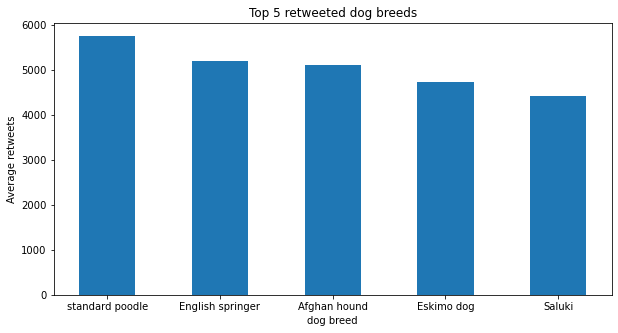
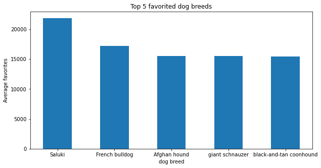
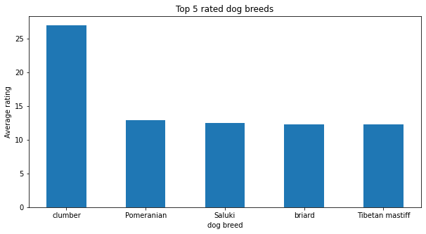

# Twitter-Data-Wrangling
This is a project in the Udacity Data professional Nanodegree, sponsored by fwd. In this project, I gathered data from different sources, assessed the data, and cleaned it. In the end, I extracted some insights from that clean data, with visualizations.

```python
import numpy as np
import pandas as pd
import matplotlib.pyplot as plt
%matplotlib inline
```

# 1) Gathering Data

## 1.1 Downloadable csv file


```python
twitter_archive_df = pd.read_csv("twitter-archive-enhanced.csv")
twitter_archive_df.head()
```


<div>
<style scoped>
    .dataframe tbody tr th:only-of-type {
        vertical-align: middle;
    }

    .dataframe tbody tr th {
        vertical-align: top;
    }

    .dataframe thead th {
        text-align: right;
    }
</style>
<table border="1" class="dataframe">
  <thead>
    <tr style="text-align: right;">
      <th></th>
      <th>tweet_id</th>
      <th>in_reply_to_status_id</th>
      <th>in_reply_to_user_id</th>
      <th>timestamp</th>
      <th>source</th>
      <th>text</th>
      <th>retweeted_status_id</th>
      <th>retweeted_status_user_id</th>
      <th>retweeted_status_timestamp</th>
      <th>expanded_urls</th>
      <th>rating_numerator</th>
      <th>rating_denominator</th>
      <th>name</th>
      <th>doggo</th>
      <th>floofer</th>
      <th>pupper</th>
      <th>puppo</th>
    </tr>
  </thead>
  <tbody>
    <tr>
      <th>0</th>
      <td>892420643555336193</td>
      <td>NaN</td>
      <td>NaN</td>
      <td>2017-08-01 16:23:56 +0000</td>
      <td>&lt;a href="http://twitter.com/download/iphone" r...</td>
      <td>This is Phineas. He's a mystical boy. Only eve...</td>
      <td>NaN</td>
      <td>NaN</td>
      <td>NaN</td>
      <td>https://twitter.com/dog_rates/status/892420643...</td>
      <td>13</td>
      <td>10</td>
      <td>Phineas</td>
      <td>None</td>
      <td>None</td>
      <td>None</td>
      <td>None</td>
    </tr>
    <tr>
      <th>1</th>
      <td>892177421306343426</td>
      <td>NaN</td>
      <td>NaN</td>
      <td>2017-08-01 00:17:27 +0000</td>
      <td>&lt;a href="http://twitter.com/download/iphone" r...</td>
      <td>This is Tilly. She's just checking pup on you....</td>
      <td>NaN</td>
      <td>NaN</td>
      <td>NaN</td>
      <td>https://twitter.com/dog_rates/status/892177421...</td>
      <td>13</td>
      <td>10</td>
      <td>Tilly</td>
      <td>None</td>
      <td>None</td>
      <td>None</td>
      <td>None</td>
    </tr>
    <tr>
      <th>2</th>
      <td>891815181378084864</td>
      <td>NaN</td>
      <td>NaN</td>
      <td>2017-07-31 00:18:03 +0000</td>
      <td>&lt;a href="http://twitter.com/download/iphone" r...</td>
      <td>This is Archie. He is a rare Norwegian Pouncin...</td>
      <td>NaN</td>
      <td>NaN</td>
      <td>NaN</td>
      <td>https://twitter.com/dog_rates/status/891815181...</td>
      <td>12</td>
      <td>10</td>
      <td>Archie</td>
      <td>None</td>
      <td>None</td>
      <td>None</td>
      <td>None</td>
    </tr>
    <tr>
      <th>3</th>
      <td>891689557279858688</td>
      <td>NaN</td>
      <td>NaN</td>
      <td>2017-07-30 15:58:51 +0000</td>
      <td>&lt;a href="http://twitter.com/download/iphone" r...</td>
      <td>This is Darla. She commenced a snooze mid meal...</td>
      <td>NaN</td>
      <td>NaN</td>
      <td>NaN</td>
      <td>https://twitter.com/dog_rates/status/891689557...</td>
      <td>13</td>
      <td>10</td>
      <td>Darla</td>
      <td>None</td>
      <td>None</td>
      <td>None</td>
      <td>None</td>
    </tr>
    <tr>
      <th>4</th>
      <td>891327558926688256</td>
      <td>NaN</td>
      <td>NaN</td>
      <td>2017-07-29 16:00:24 +0000</td>
      <td>&lt;a href="http://twitter.com/download/iphone" r...</td>
      <td>This is Franklin. He would like you to stop ca...</td>
      <td>NaN</td>
      <td>NaN</td>
      <td>NaN</td>
      <td>https://twitter.com/dog_rates/status/891327558...</td>
      <td>12</td>
      <td>10</td>
      <td>Franklin</td>
      <td>None</td>
      <td>None</td>
      <td>None</td>
      <td>None</td>
    </tr>
  </tbody>
</table>
</div>


## 1.2 The image prediciton data via requesting url

### For this part, we will be using the *requests* library
In order to parse the request succesfully, we will need to take care of 3 things:
- the request status code "e.g: 200 for success, 404 for failure"
- the request encoding "like utf-8"
- the content type "JSON, or csv, or tsv"

#### 1.2.1 fetching the request data


```python
# importing the library
import requests
```


```python
# fetching the request object
url = "https://d17h27t6h515a5.cloudfront.net/topher/2017/August/599fd2ad_image-predictions/image-predictions.tsv"
req = requests.get(url)
```


```python
# asserting a successful response code
assert(req.status_code == 200)
```

#### 1.2.2 content type and encoding

The encoding of the response, based on which we will decode it


```python
encoding = req.encoding
encoding
```


    'utf-8'


Content Type


```python
req.headers["content-type"]
```


    'text/tab-separated-values; charset=utf-8'


So the content type is, as we expect, a tsv file format

#### 1.2.3 Reading the data into a dataframe
In order to decode the data into a dataframe, we will need 2 steps
- specify the encoding scheme
- specify the delimiter in the pandas read_csv function as "\t" 

<br>I had to use "io" library, I don't know exactly why, but without it, the code crashes. <br>
[Here](https://stackoverflow.com/questions/39213597/convert-text-data-from-requests-object-to-dataframe-with-pandas) is the stack overflow post I referred to.


```python
import io
```


```python
image_prediction_df = pd.read_csv(io.StringIO(req.content.decode(encoding)), sep = "\t")
```


```python
image_prediction_df.sample(5)
```


<div>
<style scoped>
    .dataframe tbody tr th:only-of-type {
        vertical-align: middle;
    }

    .dataframe tbody tr th {
        vertical-align: top;
    }

    .dataframe thead th {
        text-align: right;
    }
</style>
<table border="1" class="dataframe">
  <thead>
    <tr style="text-align: right;">
      <th></th>
      <th>tweet_id</th>
      <th>jpg_url</th>
      <th>img_num</th>
      <th>p1</th>
      <th>p1_conf</th>
      <th>p1_dog</th>
      <th>p2</th>
      <th>p2_conf</th>
      <th>p2_dog</th>
      <th>p3</th>
      <th>p3_conf</th>
      <th>p3_dog</th>
    </tr>
  </thead>
  <tbody>
    <tr>
      <th>963</th>
      <td>705975130514706432</td>
      <td>https://pbs.twimg.com/media/CcwgjmuXIAEQoSd.jpg</td>
      <td>1</td>
      <td>Staffordshire_bullterrier</td>
      <td>0.587764</td>
      <td>True</td>
      <td>American_Staffordshire_terrier</td>
      <td>0.281429</td>
      <td>True</td>
      <td>bull_mastiff</td>
      <td>0.094798</td>
      <td>True</td>
    </tr>
    <tr>
      <th>430</th>
      <td>674269164442398721</td>
      <td>https://pbs.twimg.com/media/CVt8OmIWIAAbxvJ.jpg</td>
      <td>1</td>
      <td>pug</td>
      <td>0.622921</td>
      <td>True</td>
      <td>Norwegian_elkhound</td>
      <td>0.048659</td>
      <td>True</td>
      <td>Cardigan</td>
      <td>0.016966</td>
      <td>True</td>
    </tr>
    <tr>
      <th>412</th>
      <td>673919437611909120</td>
      <td>https://pbs.twimg.com/media/CVo-JuMWwAAet6F.jpg</td>
      <td>1</td>
      <td>jack-o'-lantern</td>
      <td>0.172079</td>
      <td>False</td>
      <td>schipperke</td>
      <td>0.115984</td>
      <td>True</td>
      <td>miniature_pinscher</td>
      <td>0.052175</td>
      <td>True</td>
    </tr>
    <tr>
      <th>2022</th>
      <td>881268444196462592</td>
      <td>https://pbs.twimg.com/media/DDrk-f9WAAI-WQv.jpg</td>
      <td>1</td>
      <td>tusker</td>
      <td>0.473303</td>
      <td>False</td>
      <td>Indian_elephant</td>
      <td>0.245646</td>
      <td>False</td>
      <td>ibex</td>
      <td>0.055661</td>
      <td>False</td>
    </tr>
    <tr>
      <th>1329</th>
      <td>757596066325864448</td>
      <td>https://pbs.twimg.com/media/CoOFmk3WEAAG6ql.jpg</td>
      <td>1</td>
      <td>doormat</td>
      <td>0.845256</td>
      <td>False</td>
      <td>wallet</td>
      <td>0.095718</td>
      <td>False</td>
      <td>wool</td>
      <td>0.026072</td>
      <td>False</td>
    </tr>
  </tbody>
</table>
</div>


Saving the dataset to a file


```python
image_prediction_df.to_csv("image_prediction.tsv", sep="\t")
```

## 1.3 The data collected via Twitter API and tweepy library
The first step is to query for the tweets whose ids exist in the twitter_archive_enhanced.csv file<br>
This is complete and all JSON data was saved in `tweets_json.txt`

The following illustrate why we did so:
- We want 2 extra features which are not available in the current datasets: which are number of likes and number or retweets
- As per the project description, The ratings probably aren't all correct. Same goes for the dog names and probably dog stages, so string matching is in order
- As such We are only interested in the tweets whose ids belong to the current dataset

#### Important *note*
While requesting data via twitter API, some tweets didn't load, probably becuause they were probably deleted<br>
The difference is about `25 tweets` so dropping these tweets will not probably affect the analysis. <br>
We will go through this again in the assessment

### 1.3.1 Parsing the data from the `tweet_json.txt` file 
for this task, we will json library to facilitate parsing json 


```python
import json
id_list = []
faves_list = []
retweets_list = []
text_list = []

# opening the tweets_json file
with open("tweet_json.txt", "r") as file:
    for line in file:
        tweet_data = json.loads(line)
        id_list.append(tweet_data["id"])
        faves_list.append(tweet_data["favorite_count"])
        retweets_list.append(tweet_data["retweet_count"])
        text_list.append(tweet_data["text"])
```

### 1.3.2 Creating a Dataframe from the parsed data 


```python
API_dict = {"tweet_id": id_list, "text": text_list, "favorite_count":faves_list, "retweet_count":retweets_list}
API_df = pd.DataFrame(API_dict)
API_df.head()
```


<div>
<style scoped>
    .dataframe tbody tr th:only-of-type {
        vertical-align: middle;
    }

    .dataframe tbody tr th {
        vertical-align: top;
    }

    .dataframe thead th {
        text-align: right;
    }
</style>
<table border="1" class="dataframe">
  <thead>
    <tr style="text-align: right;">
      <th></th>
      <th>tweet_id</th>
      <th>text</th>
      <th>favorite_count</th>
      <th>retweet_count</th>
    </tr>
  </thead>
  <tbody>
    <tr>
      <th>0</th>
      <td>892420643555336193</td>
      <td>This is Phineas. He's a mystical boy. Only eve...</td>
      <td>35527</td>
      <td>7511</td>
    </tr>
    <tr>
      <th>1</th>
      <td>892177421306343426</td>
      <td>This is Tilly. She's just checking pup on you....</td>
      <td>30750</td>
      <td>5575</td>
    </tr>
    <tr>
      <th>2</th>
      <td>891815181378084864</td>
      <td>This is Archie. He is a rare Norwegian Pouncin...</td>
      <td>23115</td>
      <td>3694</td>
    </tr>
    <tr>
      <th>3</th>
      <td>891689557279858688</td>
      <td>This is Darla. She commenced a snooze mid meal...</td>
      <td>38816</td>
      <td>7695</td>
    </tr>
    <tr>
      <th>4</th>
      <td>891327558926688256</td>
      <td>This is Franklin. He would like you to stop ca...</td>
      <td>37095</td>
      <td>8295</td>
    </tr>
  </tbody>
</table>
</div>


And that concludes our data gathering phase<br>
We collected data from 3 different sources

# 2) Assessment

### Now it is time to assess data both viusally and programmatically to see if there are issues to be fixed

## `issue `: twitter archive dataset has "None" string instead of Nan for null values in doggo, floofer, pupper, puppo tables
#### these columns must have null values instead the string "None". To prove this is an issue, run the following cells

## `issue`: twitter archive dataset has "None" string for the name column instead of Nan for dogs that have no specified names


```python
twitter_archive_df.query("name == 'None'")
```


<div>
<style scoped>
    .dataframe tbody tr th:only-of-type {
        vertical-align: middle;
    }

    .dataframe tbody tr th {
        vertical-align: top;
    }

    .dataframe thead th {
        text-align: right;
    }
</style>
<table border="1" class="dataframe">
  <thead>
    <tr style="text-align: right;">
      <th></th>
      <th>tweet_id</th>
      <th>in_reply_to_status_id</th>
      <th>in_reply_to_user_id</th>
      <th>timestamp</th>
      <th>source</th>
      <th>text</th>
      <th>retweeted_status_id</th>
      <th>retweeted_status_user_id</th>
      <th>retweeted_status_timestamp</th>
      <th>expanded_urls</th>
      <th>rating_numerator</th>
      <th>rating_denominator</th>
      <th>name</th>
      <th>doggo</th>
      <th>floofer</th>
      <th>pupper</th>
      <th>puppo</th>
    </tr>
  </thead>
  <tbody>
    <tr>
      <th>5</th>
      <td>891087950875897856</td>
      <td>NaN</td>
      <td>NaN</td>
      <td>2017-07-29 00:08:17 +0000</td>
      <td>&lt;a href="http://twitter.com/download/iphone" r...</td>
      <td>Here we have a majestic great white breaching ...</td>
      <td>NaN</td>
      <td>NaN</td>
      <td>NaN</td>
      <td>https://twitter.com/dog_rates/status/891087950...</td>
      <td>13</td>
      <td>10</td>
      <td>None</td>
      <td>None</td>
      <td>None</td>
      <td>None</td>
      <td>None</td>
    </tr>
    <tr>
      <th>7</th>
      <td>890729181411237888</td>
      <td>NaN</td>
      <td>NaN</td>
      <td>2017-07-28 00:22:40 +0000</td>
      <td>&lt;a href="http://twitter.com/download/iphone" r...</td>
      <td>When you watch your owner call another dog a g...</td>
      <td>NaN</td>
      <td>NaN</td>
      <td>NaN</td>
      <td>https://twitter.com/dog_rates/status/890729181...</td>
      <td>13</td>
      <td>10</td>
      <td>None</td>
      <td>None</td>
      <td>None</td>
      <td>None</td>
      <td>None</td>
    </tr>
    <tr>
      <th>12</th>
      <td>889665388333682689</td>
      <td>NaN</td>
      <td>NaN</td>
      <td>2017-07-25 01:55:32 +0000</td>
      <td>&lt;a href="http://twitter.com/download/iphone" r...</td>
      <td>Here's a puppo that seems to be on the fence a...</td>
      <td>NaN</td>
      <td>NaN</td>
      <td>NaN</td>
      <td>https://twitter.com/dog_rates/status/889665388...</td>
      <td>13</td>
      <td>10</td>
      <td>None</td>
      <td>None</td>
      <td>None</td>
      <td>None</td>
      <td>puppo</td>
    </tr>
    <tr>
      <th>24</th>
      <td>887343217045368832</td>
      <td>NaN</td>
      <td>NaN</td>
      <td>2017-07-18 16:08:03 +0000</td>
      <td>&lt;a href="http://twitter.com/download/iphone" r...</td>
      <td>You may not have known you needed to see this ...</td>
      <td>NaN</td>
      <td>NaN</td>
      <td>NaN</td>
      <td>https://twitter.com/dog_rates/status/887343217...</td>
      <td>13</td>
      <td>10</td>
      <td>None</td>
      <td>None</td>
      <td>None</td>
      <td>None</td>
      <td>None</td>
    </tr>
    <tr>
      <th>25</th>
      <td>887101392804085760</td>
      <td>NaN</td>
      <td>NaN</td>
      <td>2017-07-18 00:07:08 +0000</td>
      <td>&lt;a href="http://twitter.com/download/iphone" r...</td>
      <td>This... is a Jubilant Antarctic House Bear. We...</td>
      <td>NaN</td>
      <td>NaN</td>
      <td>NaN</td>
      <td>https://twitter.com/dog_rates/status/887101392...</td>
      <td>12</td>
      <td>10</td>
      <td>None</td>
      <td>None</td>
      <td>None</td>
      <td>None</td>
      <td>None</td>
    </tr>
    <tr>
      <th>...</th>
      <td>...</td>
      <td>...</td>
      <td>...</td>
      <td>...</td>
      <td>...</td>
      <td>...</td>
      <td>...</td>
      <td>...</td>
      <td>...</td>
      <td>...</td>
      <td>...</td>
      <td>...</td>
      <td>...</td>
      <td>...</td>
      <td>...</td>
      <td>...</td>
      <td>...</td>
    </tr>
    <tr>
      <th>2342</th>
      <td>666082916733198337</td>
      <td>NaN</td>
      <td>NaN</td>
      <td>2015-11-16 02:38:37 +0000</td>
      <td>&lt;a href="http://twitter.com/download/iphone" r...</td>
      <td>Here we have a well-established sunblockerspan...</td>
      <td>NaN</td>
      <td>NaN</td>
      <td>NaN</td>
      <td>https://twitter.com/dog_rates/status/666082916...</td>
      <td>6</td>
      <td>10</td>
      <td>None</td>
      <td>None</td>
      <td>None</td>
      <td>None</td>
      <td>None</td>
    </tr>
    <tr>
      <th>2343</th>
      <td>666073100786774016</td>
      <td>NaN</td>
      <td>NaN</td>
      <td>2015-11-16 01:59:36 +0000</td>
      <td>&lt;a href="http://twitter.com/download/iphone" r...</td>
      <td>Let's hope this flight isn't Malaysian (lol). ...</td>
      <td>NaN</td>
      <td>NaN</td>
      <td>NaN</td>
      <td>https://twitter.com/dog_rates/status/666073100...</td>
      <td>10</td>
      <td>10</td>
      <td>None</td>
      <td>None</td>
      <td>None</td>
      <td>None</td>
      <td>None</td>
    </tr>
    <tr>
      <th>2344</th>
      <td>666071193221509120</td>
      <td>NaN</td>
      <td>NaN</td>
      <td>2015-11-16 01:52:02 +0000</td>
      <td>&lt;a href="http://twitter.com/download/iphone" r...</td>
      <td>Here we have a northern speckled Rhododendron....</td>
      <td>NaN</td>
      <td>NaN</td>
      <td>NaN</td>
      <td>https://twitter.com/dog_rates/status/666071193...</td>
      <td>9</td>
      <td>10</td>
      <td>None</td>
      <td>None</td>
      <td>None</td>
      <td>None</td>
      <td>None</td>
    </tr>
    <tr>
      <th>2351</th>
      <td>666049248165822465</td>
      <td>NaN</td>
      <td>NaN</td>
      <td>2015-11-16 00:24:50 +0000</td>
      <td>&lt;a href="http://twitter.com/download/iphone" r...</td>
      <td>Here we have a 1949 1st generation vulpix. Enj...</td>
      <td>NaN</td>
      <td>NaN</td>
      <td>NaN</td>
      <td>https://twitter.com/dog_rates/status/666049248...</td>
      <td>5</td>
      <td>10</td>
      <td>None</td>
      <td>None</td>
      <td>None</td>
      <td>None</td>
      <td>None</td>
    </tr>
    <tr>
      <th>2355</th>
      <td>666020888022790149</td>
      <td>NaN</td>
      <td>NaN</td>
      <td>2015-11-15 22:32:08 +0000</td>
      <td>&lt;a href="http://twitter.com/download/iphone" r...</td>
      <td>Here we have a Japanese Irish Setter. Lost eye...</td>
      <td>NaN</td>
      <td>NaN</td>
      <td>NaN</td>
      <td>https://twitter.com/dog_rates/status/666020888...</td>
      <td>8</td>
      <td>10</td>
      <td>None</td>
      <td>None</td>
      <td>None</td>
      <td>None</td>
      <td>None</td>
    </tr>
  </tbody>
</table>
<p>745 rows × 17 columns</p>
</div>


```python
twitter_archive_df.head()
```


<div>
<style scoped>
    .dataframe tbody tr th:only-of-type {
        vertical-align: middle;
    }

    .dataframe tbody tr th {
        vertical-align: top;
    }

    .dataframe thead th {
        text-align: right;
    }
</style>
<table border="1" class="dataframe">
  <thead>
    <tr style="text-align: right;">
      <th></th>
      <th>tweet_id</th>
      <th>in_reply_to_status_id</th>
      <th>in_reply_to_user_id</th>
      <th>timestamp</th>
      <th>source</th>
      <th>text</th>
      <th>retweeted_status_id</th>
      <th>retweeted_status_user_id</th>
      <th>retweeted_status_timestamp</th>
      <th>expanded_urls</th>
      <th>rating_numerator</th>
      <th>rating_denominator</th>
      <th>name</th>
      <th>doggo</th>
      <th>floofer</th>
      <th>pupper</th>
      <th>puppo</th>
    </tr>
  </thead>
  <tbody>
    <tr>
      <th>0</th>
      <td>892420643555336193</td>
      <td>NaN</td>
      <td>NaN</td>
      <td>2017-08-01 16:23:56 +0000</td>
      <td>&lt;a href="http://twitter.com/download/iphone" r...</td>
      <td>This is Phineas. He's a mystical boy. Only eve...</td>
      <td>NaN</td>
      <td>NaN</td>
      <td>NaN</td>
      <td>https://twitter.com/dog_rates/status/892420643...</td>
      <td>13</td>
      <td>10</td>
      <td>Phineas</td>
      <td>None</td>
      <td>None</td>
      <td>None</td>
      <td>None</td>
    </tr>
    <tr>
      <th>1</th>
      <td>892177421306343426</td>
      <td>NaN</td>
      <td>NaN</td>
      <td>2017-08-01 00:17:27 +0000</td>
      <td>&lt;a href="http://twitter.com/download/iphone" r...</td>
      <td>This is Tilly. She's just checking pup on you....</td>
      <td>NaN</td>
      <td>NaN</td>
      <td>NaN</td>
      <td>https://twitter.com/dog_rates/status/892177421...</td>
      <td>13</td>
      <td>10</td>
      <td>Tilly</td>
      <td>None</td>
      <td>None</td>
      <td>None</td>
      <td>None</td>
    </tr>
    <tr>
      <th>2</th>
      <td>891815181378084864</td>
      <td>NaN</td>
      <td>NaN</td>
      <td>2017-07-31 00:18:03 +0000</td>
      <td>&lt;a href="http://twitter.com/download/iphone" r...</td>
      <td>This is Archie. He is a rare Norwegian Pouncin...</td>
      <td>NaN</td>
      <td>NaN</td>
      <td>NaN</td>
      <td>https://twitter.com/dog_rates/status/891815181...</td>
      <td>12</td>
      <td>10</td>
      <td>Archie</td>
      <td>None</td>
      <td>None</td>
      <td>None</td>
      <td>None</td>
    </tr>
    <tr>
      <th>3</th>
      <td>891689557279858688</td>
      <td>NaN</td>
      <td>NaN</td>
      <td>2017-07-30 15:58:51 +0000</td>
      <td>&lt;a href="http://twitter.com/download/iphone" r...</td>
      <td>This is Darla. She commenced a snooze mid meal...</td>
      <td>NaN</td>
      <td>NaN</td>
      <td>NaN</td>
      <td>https://twitter.com/dog_rates/status/891689557...</td>
      <td>13</td>
      <td>10</td>
      <td>Darla</td>
      <td>None</td>
      <td>None</td>
      <td>None</td>
      <td>None</td>
    </tr>
    <tr>
      <th>4</th>
      <td>891327558926688256</td>
      <td>NaN</td>
      <td>NaN</td>
      <td>2017-07-29 16:00:24 +0000</td>
      <td>&lt;a href="http://twitter.com/download/iphone" r...</td>
      <td>This is Franklin. He would like you to stop ca...</td>
      <td>NaN</td>
      <td>NaN</td>
      <td>NaN</td>
      <td>https://twitter.com/dog_rates/status/891327558...</td>
      <td>12</td>
      <td>10</td>
      <td>Franklin</td>
      <td>None</td>
      <td>None</td>
      <td>None</td>
      <td>None</td>
    </tr>
  </tbody>
</table>
</div>


```python
first_doggo = twitter_archive_df.doggo[0]
print("The first element in 'doggo' column is '{}' and its type is {}".format(first_doggo, type(first_doggo)))
```

    The first element in 'doggo' column is 'None' and its type is <class 'str'>
    

So apparently, this needs to be fixed, becuase then the isnull() method won't identify the string "None" as null


```python
twitter_archive_df.doggo.isnull()[0]
```


    False


## `issue ` twitter archive dataset columns doggo, floofer, pupper, puppo are values rather than variable names
#### These columns need to be grouped under one column like "dog_stage"


```python
twitter_archive_df.head()
```


<div>
<style scoped>
    .dataframe tbody tr th:only-of-type {
        vertical-align: middle;
    }

    .dataframe tbody tr th {
        vertical-align: top;
    }

    .dataframe thead th {
        text-align: right;
    }
</style>
<table border="1" class="dataframe">
  <thead>
    <tr style="text-align: right;">
      <th></th>
      <th>tweet_id</th>
      <th>in_reply_to_status_id</th>
      <th>in_reply_to_user_id</th>
      <th>timestamp</th>
      <th>source</th>
      <th>text</th>
      <th>retweeted_status_id</th>
      <th>retweeted_status_user_id</th>
      <th>retweeted_status_timestamp</th>
      <th>expanded_urls</th>
      <th>rating_numerator</th>
      <th>rating_denominator</th>
      <th>name</th>
      <th>doggo</th>
      <th>floofer</th>
      <th>pupper</th>
      <th>puppo</th>
    </tr>
  </thead>
  <tbody>
    <tr>
      <th>0</th>
      <td>892420643555336193</td>
      <td>NaN</td>
      <td>NaN</td>
      <td>2017-08-01 16:23:56 +0000</td>
      <td>&lt;a href="http://twitter.com/download/iphone" r...</td>
      <td>This is Phineas. He's a mystical boy. Only eve...</td>
      <td>NaN</td>
      <td>NaN</td>
      <td>NaN</td>
      <td>https://twitter.com/dog_rates/status/892420643...</td>
      <td>13</td>
      <td>10</td>
      <td>Phineas</td>
      <td>None</td>
      <td>None</td>
      <td>None</td>
      <td>None</td>
    </tr>
    <tr>
      <th>1</th>
      <td>892177421306343426</td>
      <td>NaN</td>
      <td>NaN</td>
      <td>2017-08-01 00:17:27 +0000</td>
      <td>&lt;a href="http://twitter.com/download/iphone" r...</td>
      <td>This is Tilly. She's just checking pup on you....</td>
      <td>NaN</td>
      <td>NaN</td>
      <td>NaN</td>
      <td>https://twitter.com/dog_rates/status/892177421...</td>
      <td>13</td>
      <td>10</td>
      <td>Tilly</td>
      <td>None</td>
      <td>None</td>
      <td>None</td>
      <td>None</td>
    </tr>
    <tr>
      <th>2</th>
      <td>891815181378084864</td>
      <td>NaN</td>
      <td>NaN</td>
      <td>2017-07-31 00:18:03 +0000</td>
      <td>&lt;a href="http://twitter.com/download/iphone" r...</td>
      <td>This is Archie. He is a rare Norwegian Pouncin...</td>
      <td>NaN</td>
      <td>NaN</td>
      <td>NaN</td>
      <td>https://twitter.com/dog_rates/status/891815181...</td>
      <td>12</td>
      <td>10</td>
      <td>Archie</td>
      <td>None</td>
      <td>None</td>
      <td>None</td>
      <td>None</td>
    </tr>
    <tr>
      <th>3</th>
      <td>891689557279858688</td>
      <td>NaN</td>
      <td>NaN</td>
      <td>2017-07-30 15:58:51 +0000</td>
      <td>&lt;a href="http://twitter.com/download/iphone" r...</td>
      <td>This is Darla. She commenced a snooze mid meal...</td>
      <td>NaN</td>
      <td>NaN</td>
      <td>NaN</td>
      <td>https://twitter.com/dog_rates/status/891689557...</td>
      <td>13</td>
      <td>10</td>
      <td>Darla</td>
      <td>None</td>
      <td>None</td>
      <td>None</td>
      <td>None</td>
    </tr>
    <tr>
      <th>4</th>
      <td>891327558926688256</td>
      <td>NaN</td>
      <td>NaN</td>
      <td>2017-07-29 16:00:24 +0000</td>
      <td>&lt;a href="http://twitter.com/download/iphone" r...</td>
      <td>This is Franklin. He would like you to stop ca...</td>
      <td>NaN</td>
      <td>NaN</td>
      <td>NaN</td>
      <td>https://twitter.com/dog_rates/status/891327558...</td>
      <td>12</td>
      <td>10</td>
      <td>Franklin</td>
      <td>None</td>
      <td>None</td>
      <td>None</td>
      <td>None</td>
    </tr>
  </tbody>
</table>
</div>


### `issue` in twitter archive dataset: not all tweets are original tweets
Some tweets are retweets or replies to other twitter users, and not rating tweets<br>
These tweets can be identified by the "retweeted_to_status_id" and "in_reply_to_status_id" columns


```python
retweeted = twitter_archive_df[twitter_archive_df.retweeted_status_id.notnull()]
retweeted
```


<div>
<style scoped>
    .dataframe tbody tr th:only-of-type {
        vertical-align: middle;
    }

    .dataframe tbody tr th {
        vertical-align: top;
    }

    .dataframe thead th {
        text-align: right;
    }
</style>
<table border="1" class="dataframe">
  <thead>
    <tr style="text-align: right;">
      <th></th>
      <th>tweet_id</th>
      <th>in_reply_to_status_id</th>
      <th>in_reply_to_user_id</th>
      <th>timestamp</th>
      <th>source</th>
      <th>text</th>
      <th>retweeted_status_id</th>
      <th>retweeted_status_user_id</th>
      <th>retweeted_status_timestamp</th>
      <th>expanded_urls</th>
      <th>rating_numerator</th>
      <th>rating_denominator</th>
      <th>name</th>
      <th>doggo</th>
      <th>floofer</th>
      <th>pupper</th>
      <th>puppo</th>
    </tr>
  </thead>
  <tbody>
    <tr>
      <th>19</th>
      <td>888202515573088257</td>
      <td>NaN</td>
      <td>NaN</td>
      <td>2017-07-21 01:02:36 +0000</td>
      <td>&lt;a href="http://twitter.com/download/iphone" r...</td>
      <td>RT @dog_rates: This is Canela. She attempted s...</td>
      <td>8.874740e+17</td>
      <td>4.196984e+09</td>
      <td>2017-07-19 00:47:34 +0000</td>
      <td>https://twitter.com/dog_rates/status/887473957...</td>
      <td>13</td>
      <td>10</td>
      <td>Canela</td>
      <td>None</td>
      <td>None</td>
      <td>None</td>
      <td>None</td>
    </tr>
    <tr>
      <th>32</th>
      <td>886054160059072513</td>
      <td>NaN</td>
      <td>NaN</td>
      <td>2017-07-15 02:45:48 +0000</td>
      <td>&lt;a href="http://twitter.com/download/iphone" r...</td>
      <td>RT @Athletics: 12/10 #BATP https://t.co/WxwJmv...</td>
      <td>8.860537e+17</td>
      <td>1.960740e+07</td>
      <td>2017-07-15 02:44:07 +0000</td>
      <td>https://twitter.com/dog_rates/status/886053434...</td>
      <td>12</td>
      <td>10</td>
      <td>None</td>
      <td>None</td>
      <td>None</td>
      <td>None</td>
      <td>None</td>
    </tr>
    <tr>
      <th>36</th>
      <td>885311592912609280</td>
      <td>NaN</td>
      <td>NaN</td>
      <td>2017-07-13 01:35:06 +0000</td>
      <td>&lt;a href="http://twitter.com/download/iphone" r...</td>
      <td>RT @dog_rates: This is Lilly. She just paralle...</td>
      <td>8.305833e+17</td>
      <td>4.196984e+09</td>
      <td>2017-02-12 01:04:29 +0000</td>
      <td>https://twitter.com/dog_rates/status/830583320...</td>
      <td>13</td>
      <td>10</td>
      <td>Lilly</td>
      <td>None</td>
      <td>None</td>
      <td>None</td>
      <td>None</td>
    </tr>
    <tr>
      <th>68</th>
      <td>879130579576475649</td>
      <td>NaN</td>
      <td>NaN</td>
      <td>2017-06-26 00:13:58 +0000</td>
      <td>&lt;a href="http://twitter.com/download/iphone" r...</td>
      <td>RT @dog_rates: This is Emmy. She was adopted t...</td>
      <td>8.780576e+17</td>
      <td>4.196984e+09</td>
      <td>2017-06-23 01:10:23 +0000</td>
      <td>https://twitter.com/dog_rates/status/878057613...</td>
      <td>14</td>
      <td>10</td>
      <td>Emmy</td>
      <td>None</td>
      <td>None</td>
      <td>None</td>
      <td>None</td>
    </tr>
    <tr>
      <th>73</th>
      <td>878404777348136964</td>
      <td>NaN</td>
      <td>NaN</td>
      <td>2017-06-24 00:09:53 +0000</td>
      <td>&lt;a href="http://twitter.com/download/iphone" r...</td>
      <td>RT @dog_rates: Meet Shadow. In an attempt to r...</td>
      <td>8.782815e+17</td>
      <td>4.196984e+09</td>
      <td>2017-06-23 16:00:04 +0000</td>
      <td>https://www.gofundme.com/3yd6y1c,https://twitt...</td>
      <td>13</td>
      <td>10</td>
      <td>Shadow</td>
      <td>None</td>
      <td>None</td>
      <td>None</td>
      <td>None</td>
    </tr>
    <tr>
      <th>...</th>
      <td>...</td>
      <td>...</td>
      <td>...</td>
      <td>...</td>
      <td>...</td>
      <td>...</td>
      <td>...</td>
      <td>...</td>
      <td>...</td>
      <td>...</td>
      <td>...</td>
      <td>...</td>
      <td>...</td>
      <td>...</td>
      <td>...</td>
      <td>...</td>
      <td>...</td>
    </tr>
    <tr>
      <th>1023</th>
      <td>746521445350707200</td>
      <td>NaN</td>
      <td>NaN</td>
      <td>2016-06-25 01:52:36 +0000</td>
      <td>&lt;a href="http://twitter.com/download/iphone" r...</td>
      <td>RT @dog_rates: This is Shaggy. He knows exactl...</td>
      <td>6.678667e+17</td>
      <td>4.196984e+09</td>
      <td>2015-11-21 00:46:50 +0000</td>
      <td>https://twitter.com/dog_rates/status/667866724...</td>
      <td>10</td>
      <td>10</td>
      <td>Shaggy</td>
      <td>None</td>
      <td>None</td>
      <td>None</td>
      <td>None</td>
    </tr>
    <tr>
      <th>1043</th>
      <td>743835915802583040</td>
      <td>NaN</td>
      <td>NaN</td>
      <td>2016-06-17 16:01:16 +0000</td>
      <td>&lt;a href="http://twitter.com/download/iphone" r...</td>
      <td>RT @dog_rates: Extremely intelligent dog here....</td>
      <td>6.671383e+17</td>
      <td>4.196984e+09</td>
      <td>2015-11-19 00:32:12 +0000</td>
      <td>https://twitter.com/dog_rates/status/667138269...</td>
      <td>10</td>
      <td>10</td>
      <td>None</td>
      <td>None</td>
      <td>None</td>
      <td>None</td>
      <td>None</td>
    </tr>
    <tr>
      <th>1242</th>
      <td>711998809858043904</td>
      <td>NaN</td>
      <td>NaN</td>
      <td>2016-03-21 19:31:59 +0000</td>
      <td>&lt;a href="http://twitter.com/download/iphone" r...</td>
      <td>RT @twitter: @dog_rates Awesome Tweet! 12/10. ...</td>
      <td>7.119983e+17</td>
      <td>7.832140e+05</td>
      <td>2016-03-21 19:29:52 +0000</td>
      <td>https://twitter.com/twitter/status/71199827977...</td>
      <td>12</td>
      <td>10</td>
      <td>None</td>
      <td>None</td>
      <td>None</td>
      <td>None</td>
      <td>None</td>
    </tr>
    <tr>
      <th>2259</th>
      <td>667550904950915073</td>
      <td>NaN</td>
      <td>NaN</td>
      <td>2015-11-20 03:51:52 +0000</td>
      <td>&lt;a href="http://twitter.com" rel="nofollow"&gt;Tw...</td>
      <td>RT @dogratingrating: Exceptional talent. Origi...</td>
      <td>6.675487e+17</td>
      <td>4.296832e+09</td>
      <td>2015-11-20 03:43:06 +0000</td>
      <td>https://twitter.com/dogratingrating/status/667...</td>
      <td>12</td>
      <td>10</td>
      <td>None</td>
      <td>None</td>
      <td>None</td>
      <td>None</td>
      <td>None</td>
    </tr>
    <tr>
      <th>2260</th>
      <td>667550882905632768</td>
      <td>NaN</td>
      <td>NaN</td>
      <td>2015-11-20 03:51:47 +0000</td>
      <td>&lt;a href="http://twitter.com" rel="nofollow"&gt;Tw...</td>
      <td>RT @dogratingrating: Unoriginal idea. Blatant ...</td>
      <td>6.675484e+17</td>
      <td>4.296832e+09</td>
      <td>2015-11-20 03:41:59 +0000</td>
      <td>https://twitter.com/dogratingrating/status/667...</td>
      <td>5</td>
      <td>10</td>
      <td>None</td>
      <td>None</td>
      <td>None</td>
      <td>None</td>
      <td>None</td>
    </tr>
  </tbody>
</table>
<p>181 rows × 17 columns</p>
</div>


```python
replied = twitter_archive_df[twitter_archive_df.in_reply_to_user_id.notnull()]
replied
```


<div>
<style scoped>
    .dataframe tbody tr th:only-of-type {
        vertical-align: middle;
    }

    .dataframe tbody tr th {
        vertical-align: top;
    }

    .dataframe thead th {
        text-align: right;
    }
</style>
<table border="1" class="dataframe">
  <thead>
    <tr style="text-align: right;">
      <th></th>
      <th>tweet_id</th>
      <th>in_reply_to_status_id</th>
      <th>in_reply_to_user_id</th>
      <th>timestamp</th>
      <th>source</th>
      <th>text</th>
      <th>retweeted_status_id</th>
      <th>retweeted_status_user_id</th>
      <th>retweeted_status_timestamp</th>
      <th>expanded_urls</th>
      <th>rating_numerator</th>
      <th>rating_denominator</th>
      <th>name</th>
      <th>doggo</th>
      <th>floofer</th>
      <th>pupper</th>
      <th>puppo</th>
    </tr>
  </thead>
  <tbody>
    <tr>
      <th>30</th>
      <td>886267009285017600</td>
      <td>8.862664e+17</td>
      <td>2.281182e+09</td>
      <td>2017-07-15 16:51:35 +0000</td>
      <td>&lt;a href="http://twitter.com/download/iphone" r...</td>
      <td>@NonWhiteHat @MayhewMayhem omg hello tanner yo...</td>
      <td>NaN</td>
      <td>NaN</td>
      <td>NaN</td>
      <td>NaN</td>
      <td>12</td>
      <td>10</td>
      <td>None</td>
      <td>None</td>
      <td>None</td>
      <td>None</td>
      <td>None</td>
    </tr>
    <tr>
      <th>55</th>
      <td>881633300179243008</td>
      <td>8.816070e+17</td>
      <td>4.738443e+07</td>
      <td>2017-07-02 21:58:53 +0000</td>
      <td>&lt;a href="http://twitter.com/download/iphone" r...</td>
      <td>@roushfenway These are good dogs but 17/10 is ...</td>
      <td>NaN</td>
      <td>NaN</td>
      <td>NaN</td>
      <td>NaN</td>
      <td>17</td>
      <td>10</td>
      <td>None</td>
      <td>None</td>
      <td>None</td>
      <td>None</td>
      <td>None</td>
    </tr>
    <tr>
      <th>64</th>
      <td>879674319642796034</td>
      <td>8.795538e+17</td>
      <td>3.105441e+09</td>
      <td>2017-06-27 12:14:36 +0000</td>
      <td>&lt;a href="http://twitter.com/download/iphone" r...</td>
      <td>@RealKentMurphy 14/10 confirmed</td>
      <td>NaN</td>
      <td>NaN</td>
      <td>NaN</td>
      <td>NaN</td>
      <td>14</td>
      <td>10</td>
      <td>None</td>
      <td>None</td>
      <td>None</td>
      <td>None</td>
      <td>None</td>
    </tr>
    <tr>
      <th>113</th>
      <td>870726314365509632</td>
      <td>8.707262e+17</td>
      <td>1.648776e+07</td>
      <td>2017-06-02 19:38:25 +0000</td>
      <td>&lt;a href="http://twitter.com/download/iphone" r...</td>
      <td>@ComplicitOwl @ShopWeRateDogs &amp;gt;10/10 is res...</td>
      <td>NaN</td>
      <td>NaN</td>
      <td>NaN</td>
      <td>NaN</td>
      <td>10</td>
      <td>10</td>
      <td>None</td>
      <td>None</td>
      <td>None</td>
      <td>None</td>
      <td>None</td>
    </tr>
    <tr>
      <th>148</th>
      <td>863427515083354112</td>
      <td>8.634256e+17</td>
      <td>7.759620e+07</td>
      <td>2017-05-13 16:15:35 +0000</td>
      <td>&lt;a href="http://twitter.com/download/iphone" r...</td>
      <td>@Jack_Septic_Eye I'd need a few more pics to p...</td>
      <td>NaN</td>
      <td>NaN</td>
      <td>NaN</td>
      <td>NaN</td>
      <td>12</td>
      <td>10</td>
      <td>None</td>
      <td>None</td>
      <td>None</td>
      <td>None</td>
      <td>None</td>
    </tr>
    <tr>
      <th>...</th>
      <td>...</td>
      <td>...</td>
      <td>...</td>
      <td>...</td>
      <td>...</td>
      <td>...</td>
      <td>...</td>
      <td>...</td>
      <td>...</td>
      <td>...</td>
      <td>...</td>
      <td>...</td>
      <td>...</td>
      <td>...</td>
      <td>...</td>
      <td>...</td>
      <td>...</td>
    </tr>
    <tr>
      <th>2038</th>
      <td>671550332464455680</td>
      <td>6.715449e+17</td>
      <td>4.196984e+09</td>
      <td>2015-12-01 04:44:10 +0000</td>
      <td>&lt;a href="http://twitter.com/download/iphone" r...</td>
      <td>After 22 minutes of careful deliberation this ...</td>
      <td>NaN</td>
      <td>NaN</td>
      <td>NaN</td>
      <td>NaN</td>
      <td>1</td>
      <td>10</td>
      <td>None</td>
      <td>None</td>
      <td>None</td>
      <td>None</td>
      <td>None</td>
    </tr>
    <tr>
      <th>2149</th>
      <td>669684865554620416</td>
      <td>6.693544e+17</td>
      <td>4.196984e+09</td>
      <td>2015-11-26 01:11:28 +0000</td>
      <td>&lt;a href="http://twitter.com/download/iphone" r...</td>
      <td>After countless hours of research and hundreds...</td>
      <td>NaN</td>
      <td>NaN</td>
      <td>NaN</td>
      <td>NaN</td>
      <td>11</td>
      <td>10</td>
      <td>None</td>
      <td>None</td>
      <td>None</td>
      <td>None</td>
      <td>None</td>
    </tr>
    <tr>
      <th>2169</th>
      <td>669353438988365824</td>
      <td>6.678065e+17</td>
      <td>4.196984e+09</td>
      <td>2015-11-25 03:14:30 +0000</td>
      <td>&lt;a href="http://twitter.com/download/iphone" r...</td>
      <td>This is Tessa. She is also very pleased after ...</td>
      <td>NaN</td>
      <td>NaN</td>
      <td>NaN</td>
      <td>https://twitter.com/dog_rates/status/669353438...</td>
      <td>10</td>
      <td>10</td>
      <td>Tessa</td>
      <td>None</td>
      <td>None</td>
      <td>None</td>
      <td>None</td>
    </tr>
    <tr>
      <th>2189</th>
      <td>668967877119254528</td>
      <td>6.689207e+17</td>
      <td>2.143566e+07</td>
      <td>2015-11-24 01:42:25 +0000</td>
      <td>&lt;a href="http://twitter.com/download/iphone" r...</td>
      <td>12/10 good shit Bubka\n@wane15</td>
      <td>NaN</td>
      <td>NaN</td>
      <td>NaN</td>
      <td>NaN</td>
      <td>12</td>
      <td>10</td>
      <td>None</td>
      <td>None</td>
      <td>None</td>
      <td>None</td>
      <td>None</td>
    </tr>
    <tr>
      <th>2298</th>
      <td>667070482143944705</td>
      <td>6.670655e+17</td>
      <td>4.196984e+09</td>
      <td>2015-11-18 20:02:51 +0000</td>
      <td>&lt;a href="http://twitter.com/download/iphone" r...</td>
      <td>After much debate this dog is being upgraded t...</td>
      <td>NaN</td>
      <td>NaN</td>
      <td>NaN</td>
      <td>NaN</td>
      <td>10</td>
      <td>10</td>
      <td>None</td>
      <td>None</td>
      <td>None</td>
      <td>None</td>
      <td>None</td>
    </tr>
  </tbody>
</table>
<p>78 rows × 17 columns</p>
</div>


##### We will check if such tweets exist in the image prediciton tweets


```python
for tweet_id in replied.tweet_id.values:
    if(tweet_id in image_prediction_df.tweet_id.values):
        print(True)
        break
```

    True
    


```python
for tweet_id in retweeted.tweet_id.values:
    if tweet_id in image_prediction_df.tweet_id.values:
        print(True)
        break
```

    True
    

So the issue extends to the image prediction dataset as well

## `issue` in twitter archive dataset The "rating_denominator" column is redundant
## sometimes it is not 10 for different reasons
Based on visual assessment
- several dogs in the tweet, so the rating numerator and denominator are multiplied by a factor
- wrong parsing of "/" character<br>

After fixing this issue, we still have a problem <br>
This column should have the same value for all tweets, so it has no added value to be included in the dataset <br>
Instead, we can refer to the denominator of the rating in a documentation for the dataset, but not in the dataset itself<br>


```python
twitter_archive_df.rating_denominator.value_counts()
```


    10     2333
    11        3
    50        3
    80        2
    20        2
    2         1
    16        1
    40        1
    70        1
    15        1
    90        1
    110       1
    120       1
    130       1
    150       1
    170       1
    7         1
    0         1
    Name: rating_denominator, dtype: int64


```python
incorrect_ids = list(twitter_archive_df.query("rating_denominator != 10").tweet_id)
```


```python
# access these urls to see exactly how the denominator and numerator are misrepresented
urls = []
for i in incorrect_ids:
    urls.append("https://twitter.com/dog_rates/status/" + str(i))
urls
```


    ['https://twitter.com/dog_rates/status/835246439529840640',
     'https://twitter.com/dog_rates/status/832088576586297345',
     'https://twitter.com/dog_rates/status/820690176645140481',
     'https://twitter.com/dog_rates/status/810984652412424192',
     'https://twitter.com/dog_rates/status/775096608509886464',
     'https://twitter.com/dog_rates/status/758467244762497024',
     'https://twitter.com/dog_rates/status/740373189193256964',
     'https://twitter.com/dog_rates/status/731156023742988288',
     'https://twitter.com/dog_rates/status/722974582966214656',
     'https://twitter.com/dog_rates/status/716439118184652801',
     'https://twitter.com/dog_rates/status/713900603437621249',
     'https://twitter.com/dog_rates/status/710658690886586372',
     'https://twitter.com/dog_rates/status/709198395643068416',
     'https://twitter.com/dog_rates/status/704054845121142784',
     'https://twitter.com/dog_rates/status/697463031882764288',
     'https://twitter.com/dog_rates/status/686035780142297088',
     'https://twitter.com/dog_rates/status/684225744407494656',
     'https://twitter.com/dog_rates/status/684222868335505415',
     'https://twitter.com/dog_rates/status/682962037429899265',
     'https://twitter.com/dog_rates/status/682808988178739200',
     'https://twitter.com/dog_rates/status/677716515794329600',
     'https://twitter.com/dog_rates/status/675853064436391936',
     'https://twitter.com/dog_rates/status/666287406224695296']


## `issue ` in twitter archive dataset, incorrect data in rating_denominator, and rating_numerator
As explained by the person who collected the data, some data may be erroneuous, and as explianed above, there are some rating denominators that are clearly wrong

## `issue` in twitter archive dataset, incorrect data in dog_name and stage name
This is because the data collector said "The ratings probably aren't all correct. Same goes for the dog names and probably dog stages too" <br>
For example, the dog name is not always capitalized


```python
twitter_archive_df.name.str.istitle().all()
```


    False


Inspecting the reason behind these lower case names, we find that these names are not actually names! <br>
They are wrongly parsed


```python
twitter_archive_df[twitter_archive_df.name.str.islower()]["name"].value_counts()
```


    a               55
    the              8
    an               7
    very             5
    just             4
    one              4
    quite            4
    not              2
    getting          2
    actually         2
    mad              2
    officially       1
    my               1
    space            1
    all              1
    life             1
    this             1
    such             1
    his              1
    old              1
    incredibly       1
    unacceptable     1
    by               1
    light            1
    infuriating      1
    Name: name, dtype: int64


```python
# this is to get the urls of such tweets to inspect them
# first collect the tweet ids
incorrect_names = list(twitter_archive_df[twitter_archive_df.name.str.islower()].tweet_id)
urls_names = []
# append them to this url to get the tweet url directly
for i in incorrect_names:
    urls_names.append("https://twitter.com/dog_rates/status/" + str(i))
urls_names
```


    ['https://twitter.com/dog_rates/status/887517139158093824',
     'https://twitter.com/dog_rates/status/881536004380872706',
     'https://twitter.com/dog_rates/status/869988702071779329',
     'https://twitter.com/dog_rates/status/859196978902773760',
     'https://twitter.com/dog_rates/status/855459453768019968',
     'https://twitter.com/dog_rates/status/832645525019123713',
     'https://twitter.com/dog_rates/status/828650029636317184',
     'https://twitter.com/dog_rates/status/806219024703037440',
     'https://twitter.com/dog_rates/status/792913359805018113',
     'https://twitter.com/dog_rates/status/788552643979468800',
     'https://twitter.com/dog_rates/status/778396591732486144',
     'https://twitter.com/dog_rates/status/776249906839351296',
     'https://twitter.com/dog_rates/status/772581559778025472',
     'https://twitter.com/dog_rates/status/770655142660169732',
     'https://twitter.com/dog_rates/status/770093767776997377',
     'https://twitter.com/dog_rates/status/765395769549590528',
     'https://twitter.com/dog_rates/status/755206590534418437',
     'https://twitter.com/dog_rates/status/748977405889503236',
     'https://twitter.com/dog_rates/status/748692773788876800',
     'https://twitter.com/dog_rates/status/748575535303884801',
     'https://twitter.com/dog_rates/status/747885874273214464',
     'https://twitter.com/dog_rates/status/747816857231626240',
     'https://twitter.com/dog_rates/status/746872823977771008',
     'https://twitter.com/dog_rates/status/746369468511756288',
     'https://twitter.com/dog_rates/status/745422732645535745',
     'https://twitter.com/dog_rates/status/744223424764059648',
     'https://twitter.com/dog_rates/status/743222593470234624',
     'https://twitter.com/dog_rates/status/741067306818797568',
     'https://twitter.com/dog_rates/status/740214038584557568',
     'https://twitter.com/dog_rates/status/736392552031657984',
     'https://twitter.com/dog_rates/status/736225175608430592',
     'https://twitter.com/dog_rates/status/731156023742988288',
     'https://twitter.com/dog_rates/status/730924654643314689',
     'https://twitter.com/dog_rates/status/728035342121635841',
     'https://twitter.com/dog_rates/status/717537687239008257',
     'https://twitter.com/dog_rates/status/715758151270801409',
     'https://twitter.com/dog_rates/status/715733265223708672',
     'https://twitter.com/dog_rates/status/710272297844797440',
     'https://twitter.com/dog_rates/status/704859558691414016',
     'https://twitter.com/dog_rates/status/704054845121142784',
     'https://twitter.com/dog_rates/status/703079050210877440',
     'https://twitter.com/dog_rates/status/703041949650034688',
     'https://twitter.com/dog_rates/status/702539513671897089',
     'https://twitter.com/dog_rates/status/700864154249383937',
     'https://twitter.com/dog_rates/status/700747788515020802',
     'https://twitter.com/dog_rates/status/697259378236399616',
     'https://twitter.com/dog_rates/status/695095422348574720',
     'https://twitter.com/dog_rates/status/692187005137076224',
     'https://twitter.com/dog_rates/status/690360449368465409',
     'https://twitter.com/dog_rates/status/685943807276412928',
     'https://twitter.com/dog_rates/status/681297372102656000',
     'https://twitter.com/dog_rates/status/680085611152338944',
     'https://twitter.com/dog_rates/status/679530280114372609',
     'https://twitter.com/dog_rates/status/679111216690831360',
     'https://twitter.com/dog_rates/status/677644091929329666',
     'https://twitter.com/dog_rates/status/677269281705472000',
     'https://twitter.com/dog_rates/status/676613908052996102',
     'https://twitter.com/dog_rates/status/675706639471788032',
     'https://twitter.com/dog_rates/status/675534494439489536',
     'https://twitter.com/dog_rates/status/675109292475830276',
     'https://twitter.com/dog_rates/status/675047298674663426',
     'https://twitter.com/dog_rates/status/674307341513269249',
     'https://twitter.com/dog_rates/status/674082852460433408',
     'https://twitter.com/dog_rates/status/673956914389192708',
     'https://twitter.com/dog_rates/status/673715861853720576',
     'https://twitter.com/dog_rates/status/673636718965334016',
     'https://twitter.com/dog_rates/status/672604026190569472',
     'https://twitter.com/dog_rates/status/672482722825261057',
     'https://twitter.com/dog_rates/status/672125275208069120',
     'https://twitter.com/dog_rates/status/671789708968640512',
     'https://twitter.com/dog_rates/status/671743150407421952',
     'https://twitter.com/dog_rates/status/671561002136281088',
     'https://twitter.com/dog_rates/status/671147085991960577',
     'https://twitter.com/dog_rates/status/670427002554466305',
     'https://twitter.com/dog_rates/status/670361874861563904',
     'https://twitter.com/dog_rates/status/670303360680108032',
     'https://twitter.com/dog_rates/status/669923323644657664',
     'https://twitter.com/dog_rates/status/669661792646373376',
     'https://twitter.com/dog_rates/status/669564461267722241',
     'https://twitter.com/dog_rates/status/668955713004314625',
     'https://twitter.com/dog_rates/status/668815180734689280',
     'https://twitter.com/dog_rates/status/668636665813057536',
     'https://twitter.com/dog_rates/status/668614819948453888',
     'https://twitter.com/dog_rates/status/668587383441514497',
     'https://twitter.com/dog_rates/status/668507509523615744',
     'https://twitter.com/dog_rates/status/668466899341221888',
     'https://twitter.com/dog_rates/status/668171859951755264',
     'https://twitter.com/dog_rates/status/667861340749471744',
     'https://twitter.com/dog_rates/status/667773195014021121',
     'https://twitter.com/dog_rates/status/667538891197542400',
     'https://twitter.com/dog_rates/status/667470559035432960',
     'https://twitter.com/dog_rates/status/667177989038297088',
     'https://twitter.com/dog_rates/status/666983947667116034',
     'https://twitter.com/dog_rates/status/666781792255496192',
     'https://twitter.com/dog_rates/status/666701168228331520',
     'https://twitter.com/dog_rates/status/666411507551481857',
     'https://twitter.com/dog_rates/status/666407126856765440',
     'https://twitter.com/dog_rates/status/666337882303524864',
     'https://twitter.com/dog_rates/status/666293911632134144',
     'https://twitter.com/dog_rates/status/666287406224695296',
     'https://twitter.com/dog_rates/status/666063827256086533',
     'https://twitter.com/dog_rates/status/666058600524156928',
     'https://twitter.com/dog_rates/status/666057090499244032',
     'https://twitter.com/dog_rates/status/666055525042405380',
     'https://twitter.com/dog_rates/status/666051853826850816',
     'https://twitter.com/dog_rates/status/666050758794694657',
     'https://twitter.com/dog_rates/status/666044226329800704',
     'https://twitter.com/dog_rates/status/666033412701032449',
     'https://twitter.com/dog_rates/status/666029285002620928']


## `issue` twitter archive dataset: dog names are sometimes upper case and sometimes lower case


```python
# this code checks if all dog names are capitalized
twitter_archive_df.name.str.istitle().all()
```


    False


## `issue` incorrect datatypes in twitter archive dataset


```python
twitter_archive_df.info()
```

    <class 'pandas.core.frame.DataFrame'>
    RangeIndex: 2356 entries, 0 to 2355
    Data columns (total 17 columns):
     #   Column                      Non-Null Count  Dtype  
    ---  ------                      --------------  -----  
     0   tweet_id                    2356 non-null   int64  
     1   in_reply_to_status_id       78 non-null     float64
     2   in_reply_to_user_id         78 non-null     float64
     3   timestamp                   2356 non-null   object 
     4   source                      2356 non-null   object 
     5   text                        2356 non-null   object 
     6   retweeted_status_id         181 non-null    float64
     7   retweeted_status_user_id    181 non-null    float64
     8   retweeted_status_timestamp  181 non-null    object 
     9   expanded_urls               2297 non-null   object 
     10  rating_numerator            2356 non-null   int64  
     11  rating_denominator          2356 non-null   int64  
     12  name                        2356 non-null   object 
     13  doggo                       2356 non-null   object 
     14  floofer                     2356 non-null   object 
     15  pupper                      2356 non-null   object 
     16  puppo                       2356 non-null   object 
    dtypes: float64(4), int64(3), object(10)
    memory usage: 313.0+ KB
    

The following datatypes are not the best suitable for data manipulation
- `timestamp` should be datetime
- `in_reply_to_status_id` should be int or string
- `in_reply_to_user_id` should be int or string
- `retweeted_status_id` should be int or string
- `retweeted_status_user_id` should be int or string
- `retweeted_status_timestamp` should be datetime

## `issue` missing data from the image prediction dataset

The number of observations in the image predcition dataset is smaller than that in the twitter archive dataset


```python
print("Archive dataset dimensions {} \n wheras image prediction dimensions are {}".format(twitter_archive_df.shape, image_prediction_df.shape))
```

    Archive dataset dimensions (2356, 17) 
     wheras image prediction dimensions are (2075, 12)
    

So there are 2356 rows in the archive dataset <br>
while there are 2075 rows in the image prediction dataset

## `issue` missing data from the twitter API dataset
In the twitter API dataset, some tweets failed to load, probably because they were deleted


```python
print(twitter_archive_df.shape)
print(API_df.shape)
```

    (2356, 17)
    (2331, 4)
    

So it is clear that the API data has 25 less tweets

## `issue` ambiguous column name in the image prediction dataset
The columns `p1`, `p2`, `p3` and `p1_conf`, `p2_conf`... can be ambiguous, and should be named like `prediction_1` to give better semantic


```python
image_prediction_df.columns
```


    Index(['tweet_id', 'jpg_url', 'img_num', 'p1', 'p1_conf', 'p1_dog', 'p2',
           'p2_conf', 'p2_dog', 'p3', 'p3_conf', 'p3_dog'],
          dtype='object')


## `issue` Data tables are not properly grouped
This is a tidiness issue. The tweet information exists in 2 tables: archive dataset and twitter api dataset<br>
The dog information exists in 2 tables: the archive dataset and the image prediction dataset

## To summarize the issues:
### Tidiness issues:
- doggo, floofer, pupper, puppo are varaible values instead of distinct variable names `archive dataset`
- Data tables not properly grouped `all datasets`
- rating denominator is redundant `archive dataset`, and not considered a variable

### Quality issues:
- using the string "None" instead of Nan for empty values in doggo, floofer, pupper, puppo columns `archive dataset`
- using the string "None" instead of Nan for empty values in name column `archive dataset`
- errors in collecting data regarding the rating_numerator and rating denominator in `archive dataset`
- possible incorrect parsing of tweet text for dog name and dog stage name `archive dataset`
- dog names are inconsistently upper and lower case `archive dataset`
- missing data from the `image prediciton dataset`
- missing data from the `twitter APi dataset`
- ambiguous column names in `image prediciton dataset`
- some data exists that are not original tweets, and should be dropped `archive dataset` and`image prediction` dataset

# 3) Cleaning
First thing to do, is to create copies of the dataframes


```python
twitter_archive_clean = twitter_archive_df.copy()
image_predictio_clean = image_prediction_df.copy()
api_clean = API_df.copy()
```

### `Resolve` missing data from twitter API dataset

#### Define
will remove tweets in the archive dataset that do not exist in the API dataset


#### Code


```python
twitter_archive_clean = twitter_archive_clean.query("tweet_id in @api_clean.tweet_id.values")
image_predictio_clean = image_predictio_clean.query("tweet_id in @api_clean.tweet_id.values")
```

#### Test
We will test that the dataframes archive dataset and api dataset have the same tweet ids


```python
assert(twitter_archive_clean.shape[0] == api_clean.shape[0])
for tweet_id in twitter_archive_clean.tweet_id.values:
    assert(tweet_id in api_clean.tweet_id.values)
```


```python
for tweet_id in image_predictio_clean.tweet_id.values:
    assert(tweet_id in api_clean.tweet_id.values)
```

### `Resolve` tweets exist in archive dataset that are retweets or replies to original tweets


#### Define:
Will filter out data that are not original tweets in all datasets

#### Code & Test


```python
twitter_archive_clean.columns
```


    Index(['tweet_id', 'in_reply_to_status_id', 'in_reply_to_user_id', 'timestamp',
           'source', 'text', 'retweeted_status_id', 'retweeted_status_user_id',
           'retweeted_status_timestamp', 'expanded_urls', 'rating_numerator',
           'rating_denominator', 'name', 'doggo', 'floofer', 'pupper', 'puppo'],
          dtype='object')


```python
twitter_archive_clean = twitter_archive_clean[twitter_archive_clean.in_reply_to_status_id.isnull()]
twitter_archive_clean = twitter_archive_clean[twitter_archive_clean.retweeted_status_id.isnull()]
twitter_archive_clean
```


<div>
<style scoped>
    .dataframe tbody tr th:only-of-type {
        vertical-align: middle;
    }

    .dataframe tbody tr th {
        vertical-align: top;
    }

    .dataframe thead th {
        text-align: right;
    }
</style>
<table border="1" class="dataframe">
  <thead>
    <tr style="text-align: right;">
      <th></th>
      <th>tweet_id</th>
      <th>in_reply_to_status_id</th>
      <th>in_reply_to_user_id</th>
      <th>timestamp</th>
      <th>source</th>
      <th>text</th>
      <th>retweeted_status_id</th>
      <th>retweeted_status_user_id</th>
      <th>retweeted_status_timestamp</th>
      <th>expanded_urls</th>
      <th>rating_numerator</th>
      <th>rating_denominator</th>
      <th>name</th>
      <th>doggo</th>
      <th>floofer</th>
      <th>pupper</th>
      <th>puppo</th>
    </tr>
  </thead>
  <tbody>
    <tr>
      <th>0</th>
      <td>892420643555336193</td>
      <td>NaN</td>
      <td>NaN</td>
      <td>2017-08-01 16:23:56 +0000</td>
      <td>&lt;a href="http://twitter.com/download/iphone" r...</td>
      <td>This is Phineas. He's a mystical boy. Only eve...</td>
      <td>NaN</td>
      <td>NaN</td>
      <td>NaN</td>
      <td>https://twitter.com/dog_rates/status/892420643...</td>
      <td>13</td>
      <td>10</td>
      <td>Phineas</td>
      <td>None</td>
      <td>None</td>
      <td>None</td>
      <td>None</td>
    </tr>
    <tr>
      <th>1</th>
      <td>892177421306343426</td>
      <td>NaN</td>
      <td>NaN</td>
      <td>2017-08-01 00:17:27 +0000</td>
      <td>&lt;a href="http://twitter.com/download/iphone" r...</td>
      <td>This is Tilly. She's just checking pup on you....</td>
      <td>NaN</td>
      <td>NaN</td>
      <td>NaN</td>
      <td>https://twitter.com/dog_rates/status/892177421...</td>
      <td>13</td>
      <td>10</td>
      <td>Tilly</td>
      <td>None</td>
      <td>None</td>
      <td>None</td>
      <td>None</td>
    </tr>
    <tr>
      <th>2</th>
      <td>891815181378084864</td>
      <td>NaN</td>
      <td>NaN</td>
      <td>2017-07-31 00:18:03 +0000</td>
      <td>&lt;a href="http://twitter.com/download/iphone" r...</td>
      <td>This is Archie. He is a rare Norwegian Pouncin...</td>
      <td>NaN</td>
      <td>NaN</td>
      <td>NaN</td>
      <td>https://twitter.com/dog_rates/status/891815181...</td>
      <td>12</td>
      <td>10</td>
      <td>Archie</td>
      <td>None</td>
      <td>None</td>
      <td>None</td>
      <td>None</td>
    </tr>
    <tr>
      <th>3</th>
      <td>891689557279858688</td>
      <td>NaN</td>
      <td>NaN</td>
      <td>2017-07-30 15:58:51 +0000</td>
      <td>&lt;a href="http://twitter.com/download/iphone" r...</td>
      <td>This is Darla. She commenced a snooze mid meal...</td>
      <td>NaN</td>
      <td>NaN</td>
      <td>NaN</td>
      <td>https://twitter.com/dog_rates/status/891689557...</td>
      <td>13</td>
      <td>10</td>
      <td>Darla</td>
      <td>None</td>
      <td>None</td>
      <td>None</td>
      <td>None</td>
    </tr>
    <tr>
      <th>4</th>
      <td>891327558926688256</td>
      <td>NaN</td>
      <td>NaN</td>
      <td>2017-07-29 16:00:24 +0000</td>
      <td>&lt;a href="http://twitter.com/download/iphone" r...</td>
      <td>This is Franklin. He would like you to stop ca...</td>
      <td>NaN</td>
      <td>NaN</td>
      <td>NaN</td>
      <td>https://twitter.com/dog_rates/status/891327558...</td>
      <td>12</td>
      <td>10</td>
      <td>Franklin</td>
      <td>None</td>
      <td>None</td>
      <td>None</td>
      <td>None</td>
    </tr>
    <tr>
      <th>...</th>
      <td>...</td>
      <td>...</td>
      <td>...</td>
      <td>...</td>
      <td>...</td>
      <td>...</td>
      <td>...</td>
      <td>...</td>
      <td>...</td>
      <td>...</td>
      <td>...</td>
      <td>...</td>
      <td>...</td>
      <td>...</td>
      <td>...</td>
      <td>...</td>
      <td>...</td>
    </tr>
    <tr>
      <th>2351</th>
      <td>666049248165822465</td>
      <td>NaN</td>
      <td>NaN</td>
      <td>2015-11-16 00:24:50 +0000</td>
      <td>&lt;a href="http://twitter.com/download/iphone" r...</td>
      <td>Here we have a 1949 1st generation vulpix. Enj...</td>
      <td>NaN</td>
      <td>NaN</td>
      <td>NaN</td>
      <td>https://twitter.com/dog_rates/status/666049248...</td>
      <td>5</td>
      <td>10</td>
      <td>None</td>
      <td>None</td>
      <td>None</td>
      <td>None</td>
      <td>None</td>
    </tr>
    <tr>
      <th>2352</th>
      <td>666044226329800704</td>
      <td>NaN</td>
      <td>NaN</td>
      <td>2015-11-16 00:04:52 +0000</td>
      <td>&lt;a href="http://twitter.com/download/iphone" r...</td>
      <td>This is a purebred Piers Morgan. Loves to Netf...</td>
      <td>NaN</td>
      <td>NaN</td>
      <td>NaN</td>
      <td>https://twitter.com/dog_rates/status/666044226...</td>
      <td>6</td>
      <td>10</td>
      <td>a</td>
      <td>None</td>
      <td>None</td>
      <td>None</td>
      <td>None</td>
    </tr>
    <tr>
      <th>2353</th>
      <td>666033412701032449</td>
      <td>NaN</td>
      <td>NaN</td>
      <td>2015-11-15 23:21:54 +0000</td>
      <td>&lt;a href="http://twitter.com/download/iphone" r...</td>
      <td>Here is a very happy pup. Big fan of well-main...</td>
      <td>NaN</td>
      <td>NaN</td>
      <td>NaN</td>
      <td>https://twitter.com/dog_rates/status/666033412...</td>
      <td>9</td>
      <td>10</td>
      <td>a</td>
      <td>None</td>
      <td>None</td>
      <td>None</td>
      <td>None</td>
    </tr>
    <tr>
      <th>2354</th>
      <td>666029285002620928</td>
      <td>NaN</td>
      <td>NaN</td>
      <td>2015-11-15 23:05:30 +0000</td>
      <td>&lt;a href="http://twitter.com/download/iphone" r...</td>
      <td>This is a western brown Mitsubishi terrier. Up...</td>
      <td>NaN</td>
      <td>NaN</td>
      <td>NaN</td>
      <td>https://twitter.com/dog_rates/status/666029285...</td>
      <td>7</td>
      <td>10</td>
      <td>a</td>
      <td>None</td>
      <td>None</td>
      <td>None</td>
      <td>None</td>
    </tr>
    <tr>
      <th>2355</th>
      <td>666020888022790149</td>
      <td>NaN</td>
      <td>NaN</td>
      <td>2015-11-15 22:32:08 +0000</td>
      <td>&lt;a href="http://twitter.com/download/iphone" r...</td>
      <td>Here we have a Japanese Irish Setter. Lost eye...</td>
      <td>NaN</td>
      <td>NaN</td>
      <td>NaN</td>
      <td>https://twitter.com/dog_rates/status/666020888...</td>
      <td>8</td>
      <td>10</td>
      <td>None</td>
      <td>None</td>
      <td>None</td>
      <td>None</td>
      <td>None</td>
    </tr>
  </tbody>
</table>
<p>2090 rows × 17 columns</p>
</div>


##### Assert that all retweet and reply data are null


```python
assert(twitter_archive_clean.in_reply_to_status_id.notnull().sum() == 0)
assert(twitter_archive_clean.retweeted_status_id.notnull().sum() == 0)
```

##### Now that all remaining tweets are not retweets or replies, we can drop columns related to retweet status, and reply status


```python
twitter_archive_clean.drop(columns=["in_reply_to_status_id", "in_reply_to_user_id", "retweeted_status_id", "retweeted_status_user_id", "retweeted_status_timestamp"], inplace=True)
```


```python
twitter_archive_clean.head()
```


<div>
<style scoped>
    .dataframe tbody tr th:only-of-type {
        vertical-align: middle;
    }

    .dataframe tbody tr th {
        vertical-align: top;
    }

    .dataframe thead th {
        text-align: right;
    }
</style>
<table border="1" class="dataframe">
  <thead>
    <tr style="text-align: right;">
      <th></th>
      <th>tweet_id</th>
      <th>timestamp</th>
      <th>source</th>
      <th>text</th>
      <th>expanded_urls</th>
      <th>rating_numerator</th>
      <th>rating_denominator</th>
      <th>name</th>
      <th>doggo</th>
      <th>floofer</th>
      <th>pupper</th>
      <th>puppo</th>
    </tr>
  </thead>
  <tbody>
    <tr>
      <th>0</th>
      <td>892420643555336193</td>
      <td>2017-08-01 16:23:56 +0000</td>
      <td>&lt;a href="http://twitter.com/download/iphone" r...</td>
      <td>This is Phineas. He's a mystical boy. Only eve...</td>
      <td>https://twitter.com/dog_rates/status/892420643...</td>
      <td>13</td>
      <td>10</td>
      <td>Phineas</td>
      <td>None</td>
      <td>None</td>
      <td>None</td>
      <td>None</td>
    </tr>
    <tr>
      <th>1</th>
      <td>892177421306343426</td>
      <td>2017-08-01 00:17:27 +0000</td>
      <td>&lt;a href="http://twitter.com/download/iphone" r...</td>
      <td>This is Tilly. She's just checking pup on you....</td>
      <td>https://twitter.com/dog_rates/status/892177421...</td>
      <td>13</td>
      <td>10</td>
      <td>Tilly</td>
      <td>None</td>
      <td>None</td>
      <td>None</td>
      <td>None</td>
    </tr>
    <tr>
      <th>2</th>
      <td>891815181378084864</td>
      <td>2017-07-31 00:18:03 +0000</td>
      <td>&lt;a href="http://twitter.com/download/iphone" r...</td>
      <td>This is Archie. He is a rare Norwegian Pouncin...</td>
      <td>https://twitter.com/dog_rates/status/891815181...</td>
      <td>12</td>
      <td>10</td>
      <td>Archie</td>
      <td>None</td>
      <td>None</td>
      <td>None</td>
      <td>None</td>
    </tr>
    <tr>
      <th>3</th>
      <td>891689557279858688</td>
      <td>2017-07-30 15:58:51 +0000</td>
      <td>&lt;a href="http://twitter.com/download/iphone" r...</td>
      <td>This is Darla. She commenced a snooze mid meal...</td>
      <td>https://twitter.com/dog_rates/status/891689557...</td>
      <td>13</td>
      <td>10</td>
      <td>Darla</td>
      <td>None</td>
      <td>None</td>
      <td>None</td>
      <td>None</td>
    </tr>
    <tr>
      <th>4</th>
      <td>891327558926688256</td>
      <td>2017-07-29 16:00:24 +0000</td>
      <td>&lt;a href="http://twitter.com/download/iphone" r...</td>
      <td>This is Franklin. He would like you to stop ca...</td>
      <td>https://twitter.com/dog_rates/status/891327558...</td>
      <td>12</td>
      <td>10</td>
      <td>Franklin</td>
      <td>None</td>
      <td>None</td>
      <td>None</td>
      <td>None</td>
    </tr>
  </tbody>
</table>
</div>


##### Now, we will also filter out non original tweets from the other datasets


```python
api_clean = api_clean.query("tweet_id in @twitter_archive_clean.tweet_id.values")
api_clean
```


<div>
<style scoped>
    .dataframe tbody tr th:only-of-type {
        vertical-align: middle;
    }

    .dataframe tbody tr th {
        vertical-align: top;
    }

    .dataframe thead th {
        text-align: right;
    }
</style>
<table border="1" class="dataframe">
  <thead>
    <tr style="text-align: right;">
      <th></th>
      <th>tweet_id</th>
      <th>text</th>
      <th>favorite_count</th>
      <th>retweet_count</th>
    </tr>
  </thead>
  <tbody>
    <tr>
      <th>0</th>
      <td>892420643555336193</td>
      <td>This is Phineas. He's a mystical boy. Only eve...</td>
      <td>35527</td>
      <td>7511</td>
    </tr>
    <tr>
      <th>1</th>
      <td>892177421306343426</td>
      <td>This is Tilly. She's just checking pup on you....</td>
      <td>30750</td>
      <td>5575</td>
    </tr>
    <tr>
      <th>2</th>
      <td>891815181378084864</td>
      <td>This is Archie. He is a rare Norwegian Pouncin...</td>
      <td>23115</td>
      <td>3694</td>
    </tr>
    <tr>
      <th>3</th>
      <td>891689557279858688</td>
      <td>This is Darla. She commenced a snooze mid meal...</td>
      <td>38816</td>
      <td>7695</td>
    </tr>
    <tr>
      <th>4</th>
      <td>891327558926688256</td>
      <td>This is Franklin. He would like you to stop ca...</td>
      <td>37095</td>
      <td>8295</td>
    </tr>
    <tr>
      <th>...</th>
      <td>...</td>
      <td>...</td>
      <td>...</td>
      <td>...</td>
    </tr>
    <tr>
      <th>2326</th>
      <td>666049248165822465</td>
      <td>Here we have a 1949 1st generation vulpix. Enj...</td>
      <td>96</td>
      <td>40</td>
    </tr>
    <tr>
      <th>2327</th>
      <td>666044226329800704</td>
      <td>This is a purebred Piers Morgan. Loves to Netf...</td>
      <td>266</td>
      <td>126</td>
    </tr>
    <tr>
      <th>2328</th>
      <td>666033412701032449</td>
      <td>Here is a very happy pup. Big fan of well-main...</td>
      <td>110</td>
      <td>39</td>
    </tr>
    <tr>
      <th>2329</th>
      <td>666029285002620928</td>
      <td>This is a western brown Mitsubishi terrier. Up...</td>
      <td>120</td>
      <td>41</td>
    </tr>
    <tr>
      <th>2330</th>
      <td>666020888022790149</td>
      <td>Here we have a Japanese Irish Setter. Lost eye...</td>
      <td>2364</td>
      <td>452</td>
    </tr>
  </tbody>
</table>
<p>2090 rows × 4 columns</p>
</div>


```python
image_predictio_clean = image_predictio_clean.query("tweet_id in @twitter_archive_clean.tweet_id.values")
image_predictio_clean
```


<div>
<style scoped>
    .dataframe tbody tr th:only-of-type {
        vertical-align: middle;
    }

    .dataframe tbody tr th {
        vertical-align: top;
    }

    .dataframe thead th {
        text-align: right;
    }
</style>
<table border="1" class="dataframe">
  <thead>
    <tr style="text-align: right;">
      <th></th>
      <th>tweet_id</th>
      <th>jpg_url</th>
      <th>img_num</th>
      <th>p1</th>
      <th>p1_conf</th>
      <th>p1_dog</th>
      <th>p2</th>
      <th>p2_conf</th>
      <th>p2_dog</th>
      <th>p3</th>
      <th>p3_conf</th>
      <th>p3_dog</th>
    </tr>
  </thead>
  <tbody>
    <tr>
      <th>0</th>
      <td>666020888022790149</td>
      <td>https://pbs.twimg.com/media/CT4udn0WwAA0aMy.jpg</td>
      <td>1</td>
      <td>Welsh_springer_spaniel</td>
      <td>0.465074</td>
      <td>True</td>
      <td>collie</td>
      <td>0.156665</td>
      <td>True</td>
      <td>Shetland_sheepdog</td>
      <td>0.061428</td>
      <td>True</td>
    </tr>
    <tr>
      <th>1</th>
      <td>666029285002620928</td>
      <td>https://pbs.twimg.com/media/CT42GRgUYAA5iDo.jpg</td>
      <td>1</td>
      <td>redbone</td>
      <td>0.506826</td>
      <td>True</td>
      <td>miniature_pinscher</td>
      <td>0.074192</td>
      <td>True</td>
      <td>Rhodesian_ridgeback</td>
      <td>0.072010</td>
      <td>True</td>
    </tr>
    <tr>
      <th>2</th>
      <td>666033412701032449</td>
      <td>https://pbs.twimg.com/media/CT4521TWwAEvMyu.jpg</td>
      <td>1</td>
      <td>German_shepherd</td>
      <td>0.596461</td>
      <td>True</td>
      <td>malinois</td>
      <td>0.138584</td>
      <td>True</td>
      <td>bloodhound</td>
      <td>0.116197</td>
      <td>True</td>
    </tr>
    <tr>
      <th>3</th>
      <td>666044226329800704</td>
      <td>https://pbs.twimg.com/media/CT5Dr8HUEAA-lEu.jpg</td>
      <td>1</td>
      <td>Rhodesian_ridgeback</td>
      <td>0.408143</td>
      <td>True</td>
      <td>redbone</td>
      <td>0.360687</td>
      <td>True</td>
      <td>miniature_pinscher</td>
      <td>0.222752</td>
      <td>True</td>
    </tr>
    <tr>
      <th>4</th>
      <td>666049248165822465</td>
      <td>https://pbs.twimg.com/media/CT5IQmsXIAAKY4A.jpg</td>
      <td>1</td>
      <td>miniature_pinscher</td>
      <td>0.560311</td>
      <td>True</td>
      <td>Rottweiler</td>
      <td>0.243682</td>
      <td>True</td>
      <td>Doberman</td>
      <td>0.154629</td>
      <td>True</td>
    </tr>
    <tr>
      <th>...</th>
      <td>...</td>
      <td>...</td>
      <td>...</td>
      <td>...</td>
      <td>...</td>
      <td>...</td>
      <td>...</td>
      <td>...</td>
      <td>...</td>
      <td>...</td>
      <td>...</td>
      <td>...</td>
    </tr>
    <tr>
      <th>2070</th>
      <td>891327558926688256</td>
      <td>https://pbs.twimg.com/media/DF6hr6BUMAAzZgT.jpg</td>
      <td>2</td>
      <td>basset</td>
      <td>0.555712</td>
      <td>True</td>
      <td>English_springer</td>
      <td>0.225770</td>
      <td>True</td>
      <td>German_short-haired_pointer</td>
      <td>0.175219</td>
      <td>True</td>
    </tr>
    <tr>
      <th>2071</th>
      <td>891689557279858688</td>
      <td>https://pbs.twimg.com/media/DF_q7IAWsAEuuN8.jpg</td>
      <td>1</td>
      <td>paper_towel</td>
      <td>0.170278</td>
      <td>False</td>
      <td>Labrador_retriever</td>
      <td>0.168086</td>
      <td>True</td>
      <td>spatula</td>
      <td>0.040836</td>
      <td>False</td>
    </tr>
    <tr>
      <th>2072</th>
      <td>891815181378084864</td>
      <td>https://pbs.twimg.com/media/DGBdLU1WsAANxJ9.jpg</td>
      <td>1</td>
      <td>Chihuahua</td>
      <td>0.716012</td>
      <td>True</td>
      <td>malamute</td>
      <td>0.078253</td>
      <td>True</td>
      <td>kelpie</td>
      <td>0.031379</td>
      <td>True</td>
    </tr>
    <tr>
      <th>2073</th>
      <td>892177421306343426</td>
      <td>https://pbs.twimg.com/media/DGGmoV4XsAAUL6n.jpg</td>
      <td>1</td>
      <td>Chihuahua</td>
      <td>0.323581</td>
      <td>True</td>
      <td>Pekinese</td>
      <td>0.090647</td>
      <td>True</td>
      <td>papillon</td>
      <td>0.068957</td>
      <td>True</td>
    </tr>
    <tr>
      <th>2074</th>
      <td>892420643555336193</td>
      <td>https://pbs.twimg.com/media/DGKD1-bXoAAIAUK.jpg</td>
      <td>1</td>
      <td>orange</td>
      <td>0.097049</td>
      <td>False</td>
      <td>bagel</td>
      <td>0.085851</td>
      <td>False</td>
      <td>banana</td>
      <td>0.076110</td>
      <td>False</td>
    </tr>
  </tbody>
</table>
<p>1964 rows × 12 columns</p>
</div>


### `Resolve` incorrect rating denominator and/or numerator

#### Define
Had to resolve the issue manually, the correct data saved in `rating_fix.csv`
`How?`
- First collected all tweet urls whose denominator was not 10
- Wrote them in a csv file
- Modified the denominator and numerator data manually after manually checking each tweet
- save the modified csv file "rating_fix.csv"

Now we will modify the twitter_archive dataset


```python
rating_fixed = pd.read_csv("rating_fix.csv")
```


```python
twitter_archive_clean.rating_denominator[twitter_archive_clean.rating_denominator != 10] = rating_fixed.rating_denominator
```

    <ipython-input-55-76690c3fa8d8>:1: SettingWithCopyWarning: 
    A value is trying to be set on a copy of a slice from a DataFrame
    
    See the caveats in the documentation: https://pandas.pydata.org/pandas-docs/stable/user_guide/indexing.html#returning-a-view-versus-a-copy
      twitter_archive_clean.rating_denominator[twitter_archive_clean.rating_denominator != 10] = rating_fixed.rating_denominator
    


```python
twitter_archive_clean.rating_numerator[twitter_archive_clean.rating_denominator != 10] = rating_fixed.rating_numerator
```

    <ipython-input-56-2c3cdd5806c6>:1: SettingWithCopyWarning: 
    A value is trying to be set on a copy of a slice from a DataFrame
    
    See the caveats in the documentation: https://pandas.pydata.org/pandas-docs/stable/user_guide/indexing.html#returning-a-view-versus-a-copy
      twitter_archive_clean.rating_numerator[twitter_archive_clean.rating_denominator != 10] = rating_fixed.rating_numerator
    


```python
twitter_archive_clean
```


<div>
<style scoped>
    .dataframe tbody tr th:only-of-type {
        vertical-align: middle;
    }

    .dataframe tbody tr th {
        vertical-align: top;
    }

    .dataframe thead th {
        text-align: right;
    }
</style>
<table border="1" class="dataframe">
  <thead>
    <tr style="text-align: right;">
      <th></th>
      <th>tweet_id</th>
      <th>timestamp</th>
      <th>source</th>
      <th>text</th>
      <th>expanded_urls</th>
      <th>rating_numerator</th>
      <th>rating_denominator</th>
      <th>name</th>
      <th>doggo</th>
      <th>floofer</th>
      <th>pupper</th>
      <th>puppo</th>
    </tr>
  </thead>
  <tbody>
    <tr>
      <th>0</th>
      <td>892420643555336193</td>
      <td>2017-08-01 16:23:56 +0000</td>
      <td>&lt;a href="http://twitter.com/download/iphone" r...</td>
      <td>This is Phineas. He's a mystical boy. Only eve...</td>
      <td>https://twitter.com/dog_rates/status/892420643...</td>
      <td>13.0</td>
      <td>10.0</td>
      <td>Phineas</td>
      <td>None</td>
      <td>None</td>
      <td>None</td>
      <td>None</td>
    </tr>
    <tr>
      <th>1</th>
      <td>892177421306343426</td>
      <td>2017-08-01 00:17:27 +0000</td>
      <td>&lt;a href="http://twitter.com/download/iphone" r...</td>
      <td>This is Tilly. She's just checking pup on you....</td>
      <td>https://twitter.com/dog_rates/status/892177421...</td>
      <td>13.0</td>
      <td>10.0</td>
      <td>Tilly</td>
      <td>None</td>
      <td>None</td>
      <td>None</td>
      <td>None</td>
    </tr>
    <tr>
      <th>2</th>
      <td>891815181378084864</td>
      <td>2017-07-31 00:18:03 +0000</td>
      <td>&lt;a href="http://twitter.com/download/iphone" r...</td>
      <td>This is Archie. He is a rare Norwegian Pouncin...</td>
      <td>https://twitter.com/dog_rates/status/891815181...</td>
      <td>12.0</td>
      <td>10.0</td>
      <td>Archie</td>
      <td>None</td>
      <td>None</td>
      <td>None</td>
      <td>None</td>
    </tr>
    <tr>
      <th>3</th>
      <td>891689557279858688</td>
      <td>2017-07-30 15:58:51 +0000</td>
      <td>&lt;a href="http://twitter.com/download/iphone" r...</td>
      <td>This is Darla. She commenced a snooze mid meal...</td>
      <td>https://twitter.com/dog_rates/status/891689557...</td>
      <td>13.0</td>
      <td>10.0</td>
      <td>Darla</td>
      <td>None</td>
      <td>None</td>
      <td>None</td>
      <td>None</td>
    </tr>
    <tr>
      <th>4</th>
      <td>891327558926688256</td>
      <td>2017-07-29 16:00:24 +0000</td>
      <td>&lt;a href="http://twitter.com/download/iphone" r...</td>
      <td>This is Franklin. He would like you to stop ca...</td>
      <td>https://twitter.com/dog_rates/status/891327558...</td>
      <td>12.0</td>
      <td>10.0</td>
      <td>Franklin</td>
      <td>None</td>
      <td>None</td>
      <td>None</td>
      <td>None</td>
    </tr>
    <tr>
      <th>...</th>
      <td>...</td>
      <td>...</td>
      <td>...</td>
      <td>...</td>
      <td>...</td>
      <td>...</td>
      <td>...</td>
      <td>...</td>
      <td>...</td>
      <td>...</td>
      <td>...</td>
      <td>...</td>
    </tr>
    <tr>
      <th>2351</th>
      <td>666049248165822465</td>
      <td>2015-11-16 00:24:50 +0000</td>
      <td>&lt;a href="http://twitter.com/download/iphone" r...</td>
      <td>Here we have a 1949 1st generation vulpix. Enj...</td>
      <td>https://twitter.com/dog_rates/status/666049248...</td>
      <td>5.0</td>
      <td>10.0</td>
      <td>None</td>
      <td>None</td>
      <td>None</td>
      <td>None</td>
      <td>None</td>
    </tr>
    <tr>
      <th>2352</th>
      <td>666044226329800704</td>
      <td>2015-11-16 00:04:52 +0000</td>
      <td>&lt;a href="http://twitter.com/download/iphone" r...</td>
      <td>This is a purebred Piers Morgan. Loves to Netf...</td>
      <td>https://twitter.com/dog_rates/status/666044226...</td>
      <td>6.0</td>
      <td>10.0</td>
      <td>a</td>
      <td>None</td>
      <td>None</td>
      <td>None</td>
      <td>None</td>
    </tr>
    <tr>
      <th>2353</th>
      <td>666033412701032449</td>
      <td>2015-11-15 23:21:54 +0000</td>
      <td>&lt;a href="http://twitter.com/download/iphone" r...</td>
      <td>Here is a very happy pup. Big fan of well-main...</td>
      <td>https://twitter.com/dog_rates/status/666033412...</td>
      <td>9.0</td>
      <td>10.0</td>
      <td>a</td>
      <td>None</td>
      <td>None</td>
      <td>None</td>
      <td>None</td>
    </tr>
    <tr>
      <th>2354</th>
      <td>666029285002620928</td>
      <td>2015-11-15 23:05:30 +0000</td>
      <td>&lt;a href="http://twitter.com/download/iphone" r...</td>
      <td>This is a western brown Mitsubishi terrier. Up...</td>
      <td>https://twitter.com/dog_rates/status/666029285...</td>
      <td>7.0</td>
      <td>10.0</td>
      <td>a</td>
      <td>None</td>
      <td>None</td>
      <td>None</td>
      <td>None</td>
    </tr>
    <tr>
      <th>2355</th>
      <td>666020888022790149</td>
      <td>2015-11-15 22:32:08 +0000</td>
      <td>&lt;a href="http://twitter.com/download/iphone" r...</td>
      <td>Here we have a Japanese Irish Setter. Lost eye...</td>
      <td>https://twitter.com/dog_rates/status/666020888...</td>
      <td>8.0</td>
      <td>10.0</td>
      <td>None</td>
      <td>None</td>
      <td>None</td>
      <td>None</td>
      <td>None</td>
    </tr>
  </tbody>
</table>
<p>2090 rows × 12 columns</p>
</div>


Drop the denominator column


```python
twitter_archive_clean.drop(columns=["rating_denominator"], inplace=True)
twitter_archive_clean
```


<div>
<style scoped>
    .dataframe tbody tr th:only-of-type {
        vertical-align: middle;
    }

    .dataframe tbody tr th {
        vertical-align: top;
    }

    .dataframe thead th {
        text-align: right;
    }
</style>
<table border="1" class="dataframe">
  <thead>
    <tr style="text-align: right;">
      <th></th>
      <th>tweet_id</th>
      <th>timestamp</th>
      <th>source</th>
      <th>text</th>
      <th>expanded_urls</th>
      <th>rating_numerator</th>
      <th>name</th>
      <th>doggo</th>
      <th>floofer</th>
      <th>pupper</th>
      <th>puppo</th>
    </tr>
  </thead>
  <tbody>
    <tr>
      <th>0</th>
      <td>892420643555336193</td>
      <td>2017-08-01 16:23:56 +0000</td>
      <td>&lt;a href="http://twitter.com/download/iphone" r...</td>
      <td>This is Phineas. He's a mystical boy. Only eve...</td>
      <td>https://twitter.com/dog_rates/status/892420643...</td>
      <td>13.0</td>
      <td>Phineas</td>
      <td>None</td>
      <td>None</td>
      <td>None</td>
      <td>None</td>
    </tr>
    <tr>
      <th>1</th>
      <td>892177421306343426</td>
      <td>2017-08-01 00:17:27 +0000</td>
      <td>&lt;a href="http://twitter.com/download/iphone" r...</td>
      <td>This is Tilly. She's just checking pup on you....</td>
      <td>https://twitter.com/dog_rates/status/892177421...</td>
      <td>13.0</td>
      <td>Tilly</td>
      <td>None</td>
      <td>None</td>
      <td>None</td>
      <td>None</td>
    </tr>
    <tr>
      <th>2</th>
      <td>891815181378084864</td>
      <td>2017-07-31 00:18:03 +0000</td>
      <td>&lt;a href="http://twitter.com/download/iphone" r...</td>
      <td>This is Archie. He is a rare Norwegian Pouncin...</td>
      <td>https://twitter.com/dog_rates/status/891815181...</td>
      <td>12.0</td>
      <td>Archie</td>
      <td>None</td>
      <td>None</td>
      <td>None</td>
      <td>None</td>
    </tr>
    <tr>
      <th>3</th>
      <td>891689557279858688</td>
      <td>2017-07-30 15:58:51 +0000</td>
      <td>&lt;a href="http://twitter.com/download/iphone" r...</td>
      <td>This is Darla. She commenced a snooze mid meal...</td>
      <td>https://twitter.com/dog_rates/status/891689557...</td>
      <td>13.0</td>
      <td>Darla</td>
      <td>None</td>
      <td>None</td>
      <td>None</td>
      <td>None</td>
    </tr>
    <tr>
      <th>4</th>
      <td>891327558926688256</td>
      <td>2017-07-29 16:00:24 +0000</td>
      <td>&lt;a href="http://twitter.com/download/iphone" r...</td>
      <td>This is Franklin. He would like you to stop ca...</td>
      <td>https://twitter.com/dog_rates/status/891327558...</td>
      <td>12.0</td>
      <td>Franklin</td>
      <td>None</td>
      <td>None</td>
      <td>None</td>
      <td>None</td>
    </tr>
    <tr>
      <th>...</th>
      <td>...</td>
      <td>...</td>
      <td>...</td>
      <td>...</td>
      <td>...</td>
      <td>...</td>
      <td>...</td>
      <td>...</td>
      <td>...</td>
      <td>...</td>
      <td>...</td>
    </tr>
    <tr>
      <th>2351</th>
      <td>666049248165822465</td>
      <td>2015-11-16 00:24:50 +0000</td>
      <td>&lt;a href="http://twitter.com/download/iphone" r...</td>
      <td>Here we have a 1949 1st generation vulpix. Enj...</td>
      <td>https://twitter.com/dog_rates/status/666049248...</td>
      <td>5.0</td>
      <td>None</td>
      <td>None</td>
      <td>None</td>
      <td>None</td>
      <td>None</td>
    </tr>
    <tr>
      <th>2352</th>
      <td>666044226329800704</td>
      <td>2015-11-16 00:04:52 +0000</td>
      <td>&lt;a href="http://twitter.com/download/iphone" r...</td>
      <td>This is a purebred Piers Morgan. Loves to Netf...</td>
      <td>https://twitter.com/dog_rates/status/666044226...</td>
      <td>6.0</td>
      <td>a</td>
      <td>None</td>
      <td>None</td>
      <td>None</td>
      <td>None</td>
    </tr>
    <tr>
      <th>2353</th>
      <td>666033412701032449</td>
      <td>2015-11-15 23:21:54 +0000</td>
      <td>&lt;a href="http://twitter.com/download/iphone" r...</td>
      <td>Here is a very happy pup. Big fan of well-main...</td>
      <td>https://twitter.com/dog_rates/status/666033412...</td>
      <td>9.0</td>
      <td>a</td>
      <td>None</td>
      <td>None</td>
      <td>None</td>
      <td>None</td>
    </tr>
    <tr>
      <th>2354</th>
      <td>666029285002620928</td>
      <td>2015-11-15 23:05:30 +0000</td>
      <td>&lt;a href="http://twitter.com/download/iphone" r...</td>
      <td>This is a western brown Mitsubishi terrier. Up...</td>
      <td>https://twitter.com/dog_rates/status/666029285...</td>
      <td>7.0</td>
      <td>a</td>
      <td>None</td>
      <td>None</td>
      <td>None</td>
      <td>None</td>
    </tr>
    <tr>
      <th>2355</th>
      <td>666020888022790149</td>
      <td>2015-11-15 22:32:08 +0000</td>
      <td>&lt;a href="http://twitter.com/download/iphone" r...</td>
      <td>Here we have a Japanese Irish Setter. Lost eye...</td>
      <td>https://twitter.com/dog_rates/status/666020888...</td>
      <td>8.0</td>
      <td>None</td>
      <td>None</td>
      <td>None</td>
      <td>None</td>
      <td>None</td>
    </tr>
  </tbody>
</table>
<p>2090 rows × 11 columns</p>
</div>


### `Resolve`: missing data from the image prediction dataset


#### Define
The tweets in the image prediction dataset are *part* of the tweets in the archive dataset<br>
However, we do not have access to the neural network that generated the image predictions, so we have 2 options
- Remove tweets that do not exist in the image prediction dataset
- Keep the data as it is <br>

Removing data as in the first option has no real benefit other than making the datasets look nicer <br>
I will chose the second, since removing data unnecessairly may adeversely affect analysis later on

### `Resolve 2x` 
- doggo, floofer, pupper, puppo columns have "None" strings instead of Nan
- doggo, floofer, pupper, puppo are varaible values instead of distinct variable names

#### Define
We will parse the api dataset to avoid any possible errors in the archive dataset text<br>
also, we will collect the stage name under one column<br>
This resolves 3 issues.
- Using the api dataset clears all possible errors 
- iterating all tweets and gathering information in one column will make data tidier
- Assigning empty strings to np.nan will resolve the "None" string issue

#### Code


```python
stage_name_list = []

#iterating over all tweets
for text in api_clean.text.values:
    # will append stage names
    collective_stage_name = ""
    if "doggo" in text.lower():
        collective_stage_name+= "doggo-"
    if "floofer" in text.lower():
        collective_stage_name+="floofer-"
    if "puppo" in text.lower():
        collective_stage_name+= "puppo-"
    if "pupper" in text.lower():
        collective_stage_name+= "pupper"
    if len(collective_stage_name) ==0:
        collective_stage_name = np.nan
    else:
        collective_stage_name = collective_stage_name.strip("-")
    stage_name_list.append(collective_stage_name)
```


```python
# create a new column with the acquired list
twitter_archive_clean["stage_name"] = stage_name_list
```


```python
twitter_archive_clean.head()
```


<div>
<style scoped>
    .dataframe tbody tr th:only-of-type {
        vertical-align: middle;
    }

    .dataframe tbody tr th {
        vertical-align: top;
    }

    .dataframe thead th {
        text-align: right;
    }
</style>
<table border="1" class="dataframe">
  <thead>
    <tr style="text-align: right;">
      <th></th>
      <th>tweet_id</th>
      <th>timestamp</th>
      <th>source</th>
      <th>text</th>
      <th>expanded_urls</th>
      <th>rating_numerator</th>
      <th>name</th>
      <th>doggo</th>
      <th>floofer</th>
      <th>pupper</th>
      <th>puppo</th>
      <th>stage_name</th>
    </tr>
  </thead>
  <tbody>
    <tr>
      <th>0</th>
      <td>892420643555336193</td>
      <td>2017-08-01 16:23:56 +0000</td>
      <td>&lt;a href="http://twitter.com/download/iphone" r...</td>
      <td>This is Phineas. He's a mystical boy. Only eve...</td>
      <td>https://twitter.com/dog_rates/status/892420643...</td>
      <td>13.0</td>
      <td>Phineas</td>
      <td>None</td>
      <td>None</td>
      <td>None</td>
      <td>None</td>
      <td>NaN</td>
    </tr>
    <tr>
      <th>1</th>
      <td>892177421306343426</td>
      <td>2017-08-01 00:17:27 +0000</td>
      <td>&lt;a href="http://twitter.com/download/iphone" r...</td>
      <td>This is Tilly. She's just checking pup on you....</td>
      <td>https://twitter.com/dog_rates/status/892177421...</td>
      <td>13.0</td>
      <td>Tilly</td>
      <td>None</td>
      <td>None</td>
      <td>None</td>
      <td>None</td>
      <td>NaN</td>
    </tr>
    <tr>
      <th>2</th>
      <td>891815181378084864</td>
      <td>2017-07-31 00:18:03 +0000</td>
      <td>&lt;a href="http://twitter.com/download/iphone" r...</td>
      <td>This is Archie. He is a rare Norwegian Pouncin...</td>
      <td>https://twitter.com/dog_rates/status/891815181...</td>
      <td>12.0</td>
      <td>Archie</td>
      <td>None</td>
      <td>None</td>
      <td>None</td>
      <td>None</td>
      <td>NaN</td>
    </tr>
    <tr>
      <th>3</th>
      <td>891689557279858688</td>
      <td>2017-07-30 15:58:51 +0000</td>
      <td>&lt;a href="http://twitter.com/download/iphone" r...</td>
      <td>This is Darla. She commenced a snooze mid meal...</td>
      <td>https://twitter.com/dog_rates/status/891689557...</td>
      <td>13.0</td>
      <td>Darla</td>
      <td>None</td>
      <td>None</td>
      <td>None</td>
      <td>None</td>
      <td>NaN</td>
    </tr>
    <tr>
      <th>4</th>
      <td>891327558926688256</td>
      <td>2017-07-29 16:00:24 +0000</td>
      <td>&lt;a href="http://twitter.com/download/iphone" r...</td>
      <td>This is Franklin. He would like you to stop ca...</td>
      <td>https://twitter.com/dog_rates/status/891327558...</td>
      <td>12.0</td>
      <td>Franklin</td>
      <td>None</td>
      <td>None</td>
      <td>None</td>
      <td>None</td>
      <td>NaN</td>
    </tr>
  </tbody>
</table>
</div>


```python
twitter_archive_clean.drop(columns=["doggo", "floofer", "pupper", "puppo"], inplace=True)
```

#### Test


```python
twitter_archive_clean.head()
```


<div>
<style scoped>
    .dataframe tbody tr th:only-of-type {
        vertical-align: middle;
    }

    .dataframe tbody tr th {
        vertical-align: top;
    }

    .dataframe thead th {
        text-align: right;
    }
</style>
<table border="1" class="dataframe">
  <thead>
    <tr style="text-align: right;">
      <th></th>
      <th>tweet_id</th>
      <th>timestamp</th>
      <th>source</th>
      <th>text</th>
      <th>expanded_urls</th>
      <th>rating_numerator</th>
      <th>name</th>
      <th>stage_name</th>
    </tr>
  </thead>
  <tbody>
    <tr>
      <th>0</th>
      <td>892420643555336193</td>
      <td>2017-08-01 16:23:56 +0000</td>
      <td>&lt;a href="http://twitter.com/download/iphone" r...</td>
      <td>This is Phineas. He's a mystical boy. Only eve...</td>
      <td>https://twitter.com/dog_rates/status/892420643...</td>
      <td>13.0</td>
      <td>Phineas</td>
      <td>NaN</td>
    </tr>
    <tr>
      <th>1</th>
      <td>892177421306343426</td>
      <td>2017-08-01 00:17:27 +0000</td>
      <td>&lt;a href="http://twitter.com/download/iphone" r...</td>
      <td>This is Tilly. She's just checking pup on you....</td>
      <td>https://twitter.com/dog_rates/status/892177421...</td>
      <td>13.0</td>
      <td>Tilly</td>
      <td>NaN</td>
    </tr>
    <tr>
      <th>2</th>
      <td>891815181378084864</td>
      <td>2017-07-31 00:18:03 +0000</td>
      <td>&lt;a href="http://twitter.com/download/iphone" r...</td>
      <td>This is Archie. He is a rare Norwegian Pouncin...</td>
      <td>https://twitter.com/dog_rates/status/891815181...</td>
      <td>12.0</td>
      <td>Archie</td>
      <td>NaN</td>
    </tr>
    <tr>
      <th>3</th>
      <td>891689557279858688</td>
      <td>2017-07-30 15:58:51 +0000</td>
      <td>&lt;a href="http://twitter.com/download/iphone" r...</td>
      <td>This is Darla. She commenced a snooze mid meal...</td>
      <td>https://twitter.com/dog_rates/status/891689557...</td>
      <td>13.0</td>
      <td>Darla</td>
      <td>NaN</td>
    </tr>
    <tr>
      <th>4</th>
      <td>891327558926688256</td>
      <td>2017-07-29 16:00:24 +0000</td>
      <td>&lt;a href="http://twitter.com/download/iphone" r...</td>
      <td>This is Franklin. He would like you to stop ca...</td>
      <td>https://twitter.com/dog_rates/status/891327558...</td>
      <td>12.0</td>
      <td>Franklin</td>
      <td>NaN</td>
    </tr>
  </tbody>
</table>
</div>


### `Resolve` Incorrect parsing of dog names
#### Define
From our assessment, we can see that all lower case names are wrongly parsed. We will try to fix this manually

#### Code & Test


```python
# this is to get the urls of such tweets to inspect them
# first collect the tweet ids
incorrect_names = list(twitter_archive_clean[twitter_archive_clean.name.str.islower()].tweet_id)
urls_names = []
# append them to this url to get the tweet url directly
for i in incorrect_names:
    urls_names.append("https://twitter.com/dog_rates/status/" + str(i))
len(urls_names)
incorrect_names["urls"] = urls_names
```


    104


After that I saved this dataframe to "name_fix.csv". I didn't include the code in order not to overwwrite my manual fix


```python
names_fixed_df = pd.read_csv("name_fix.csv")
name_col = names_fixed_df["name"]
```


```python
# Now we assign the data we evaluated to be misparsed to this fixed data
twitter_archive_clean.name[twitter_archive_clean.name.str.islower()] = name_col
```

    <ipython-input-79-499e3c2517bd>:2: SettingWithCopyWarning: 
    A value is trying to be set on a copy of a slice from a DataFrame
    
    See the caveats in the documentation: https://pandas.pydata.org/pandas-docs/stable/user_guide/indexing.html#returning-a-view-versus-a-copy
      twitter_archive_clean.name[twitter_archive_clean.name.str.islower()] = name_col
    


```python
#checking if our modification made effect
twitter_archive_clean.name.str.islower().sum()
```


    0


While manually fixing, I found that some tweets had photos of a turtle, a cat, a person, a fish, a deer, a sloth!!!<br>
I know the page is comic but I think these should be removed


```python
irrelevant_tweets_ids = [666051853826850816, 666293911632134144, 666411507551481857, 748692773788876800, 673715861853720576, 669661792646373376,668614819948453888, 668466899341221888]
```


```python
twitter_archive_clean = twitter_archive_clean.query("tweet_id not in @irrelevant_tweets_ids")
api_clean = api_clean.query("tweet_id not in @irrelevant_tweets_ids")
image_predictio_clean = image_predictio_clean.query("tweet_id not in @irrelevant_tweets_ids")
```

### `Resolve`: Datasets are not properly grouped
#### Define
We can see that all data can be grouped into one dataframe, where they all belong to one observational unit: "The tweet" <br>
This will be done on 2 steps:
1. merge the api_clean and tweet_archive_clean datasets
2. merge the resulting dataset with the image prediciton dataset

1. merge the api_clean with twitter_archive_clean
- First, drop the "text" column from the archived dataframe
- Perform merge of API dataframe and archive dataframe

#### Code & Testing


```python
twitter_archive_clean.drop(columns=["text"], inplace = True)
twitter_archive_clean.columns
```


    Index(['tweet_id', 'timestamp', 'source', 'expanded_urls', 'rating_numerator',
           'name', 'stage_name'],
          dtype='object')


```python
twitter_archive_clean.info()
```

    <class 'pandas.core.frame.DataFrame'>
    Int64Index: 2082 entries, 0 to 2355
    Data columns (total 7 columns):
     #   Column            Non-Null Count  Dtype  
    ---  ------            --------------  -----  
     0   tweet_id          2082 non-null   int64  
     1   timestamp         2082 non-null   object 
     2   source            2082 non-null   object 
     3   expanded_urls     2079 non-null   object 
     4   rating_numerator  2065 non-null   float64
     5   name              1986 non-null   object 
     6   stage_name        363 non-null    object 
    dtypes: float64(1), int64(1), object(5)
    memory usage: 130.1+ KB
    


```python
tweet_df = api_clean.set_index("tweet_id").join(twitter_archive_clean.set_index("tweet_id"), how = "inner")
```


```python
tweet_df.shape
```


    (2082, 9)


```python
tweet_df
```


<div>
<style scoped>
    .dataframe tbody tr th:only-of-type {
        vertical-align: middle;
    }

    .dataframe tbody tr th {
        vertical-align: top;
    }

    .dataframe thead th {
        text-align: right;
    }
</style>
<table border="1" class="dataframe">
  <thead>
    <tr style="text-align: right;">
      <th></th>
      <th>text</th>
      <th>favorite_count</th>
      <th>retweet_count</th>
      <th>timestamp</th>
      <th>source</th>
      <th>expanded_urls</th>
      <th>rating_numerator</th>
      <th>name</th>
      <th>stage_name</th>
    </tr>
    <tr>
      <th>tweet_id</th>
      <th></th>
      <th></th>
      <th></th>
      <th></th>
      <th></th>
      <th></th>
      <th></th>
      <th></th>
      <th></th>
    </tr>
  </thead>
  <tbody>
    <tr>
      <th>892420643555336193</th>
      <td>This is Phineas. He's a mystical boy. Only eve...</td>
      <td>35527</td>
      <td>7511</td>
      <td>2017-08-01 16:23:56 +0000</td>
      <td>&lt;a href="http://twitter.com/download/iphone" r...</td>
      <td>https://twitter.com/dog_rates/status/892420643...</td>
      <td>13.0</td>
      <td>Phineas</td>
      <td>NaN</td>
    </tr>
    <tr>
      <th>892177421306343426</th>
      <td>This is Tilly. She's just checking pup on you....</td>
      <td>30750</td>
      <td>5575</td>
      <td>2017-08-01 00:17:27 +0000</td>
      <td>&lt;a href="http://twitter.com/download/iphone" r...</td>
      <td>https://twitter.com/dog_rates/status/892177421...</td>
      <td>13.0</td>
      <td>Tilly</td>
      <td>NaN</td>
    </tr>
    <tr>
      <th>891815181378084864</th>
      <td>This is Archie. He is a rare Norwegian Pouncin...</td>
      <td>23115</td>
      <td>3694</td>
      <td>2017-07-31 00:18:03 +0000</td>
      <td>&lt;a href="http://twitter.com/download/iphone" r...</td>
      <td>https://twitter.com/dog_rates/status/891815181...</td>
      <td>12.0</td>
      <td>Archie</td>
      <td>NaN</td>
    </tr>
    <tr>
      <th>891689557279858688</th>
      <td>This is Darla. She commenced a snooze mid meal...</td>
      <td>38816</td>
      <td>7695</td>
      <td>2017-07-30 15:58:51 +0000</td>
      <td>&lt;a href="http://twitter.com/download/iphone" r...</td>
      <td>https://twitter.com/dog_rates/status/891689557...</td>
      <td>13.0</td>
      <td>Darla</td>
      <td>NaN</td>
    </tr>
    <tr>
      <th>891327558926688256</th>
      <td>This is Franklin. He would like you to stop ca...</td>
      <td>37095</td>
      <td>8295</td>
      <td>2017-07-29 16:00:24 +0000</td>
      <td>&lt;a href="http://twitter.com/download/iphone" r...</td>
      <td>https://twitter.com/dog_rates/status/891327558...</td>
      <td>12.0</td>
      <td>Franklin</td>
      <td>NaN</td>
    </tr>
    <tr>
      <th>...</th>
      <td>...</td>
      <td>...</td>
      <td>...</td>
      <td>...</td>
      <td>...</td>
      <td>...</td>
      <td>...</td>
      <td>...</td>
      <td>...</td>
    </tr>
    <tr>
      <th>666049248165822465</th>
      <td>Here we have a 1949 1st generation vulpix. Enj...</td>
      <td>96</td>
      <td>40</td>
      <td>2015-11-16 00:24:50 +0000</td>
      <td>&lt;a href="http://twitter.com/download/iphone" r...</td>
      <td>https://twitter.com/dog_rates/status/666049248...</td>
      <td>5.0</td>
      <td>None</td>
      <td>NaN</td>
    </tr>
    <tr>
      <th>666044226329800704</th>
      <td>This is a purebred Piers Morgan. Loves to Netf...</td>
      <td>266</td>
      <td>126</td>
      <td>2015-11-16 00:04:52 +0000</td>
      <td>&lt;a href="http://twitter.com/download/iphone" r...</td>
      <td>https://twitter.com/dog_rates/status/666044226...</td>
      <td>6.0</td>
      <td>NaN</td>
      <td>NaN</td>
    </tr>
    <tr>
      <th>666033412701032449</th>
      <td>Here is a very happy pup. Big fan of well-main...</td>
      <td>110</td>
      <td>39</td>
      <td>2015-11-15 23:21:54 +0000</td>
      <td>&lt;a href="http://twitter.com/download/iphone" r...</td>
      <td>https://twitter.com/dog_rates/status/666033412...</td>
      <td>9.0</td>
      <td>NaN</td>
      <td>NaN</td>
    </tr>
    <tr>
      <th>666029285002620928</th>
      <td>This is a western brown Mitsubishi terrier. Up...</td>
      <td>120</td>
      <td>41</td>
      <td>2015-11-15 23:05:30 +0000</td>
      <td>&lt;a href="http://twitter.com/download/iphone" r...</td>
      <td>https://twitter.com/dog_rates/status/666029285...</td>
      <td>7.0</td>
      <td>NaN</td>
      <td>NaN</td>
    </tr>
    <tr>
      <th>666020888022790149</th>
      <td>Here we have a Japanese Irish Setter. Lost eye...</td>
      <td>2364</td>
      <td>452</td>
      <td>2015-11-15 22:32:08 +0000</td>
      <td>&lt;a href="http://twitter.com/download/iphone" r...</td>
      <td>https://twitter.com/dog_rates/status/666020888...</td>
      <td>8.0</td>
      <td>None</td>
      <td>NaN</td>
    </tr>
  </tbody>
</table>
<p>2082 rows × 9 columns</p>
</div>


Now, we will try to appropriately extract dog information from the tweet_clean_df and image prediction dataframe

2. Merge the image_prediction dataset with the tweet_df data


```python
tweet_df = tweet_df.join(image_predictio_clean.set_index("tweet_id"))
```


```python
tweet_df.info()
```

    <class 'pandas.core.frame.DataFrame'>
    Int64Index: 2082 entries, 892420643555336193 to 666020888022790149
    Data columns (total 20 columns):
     #   Column            Non-Null Count  Dtype  
    ---  ------            --------------  -----  
     0   text              2082 non-null   object 
     1   favorite_count    2082 non-null   int64  
     2   retweet_count     2082 non-null   int64  
     3   timestamp         2082 non-null   object 
     4   source            2082 non-null   object 
     5   expanded_urls     2079 non-null   object 
     6   rating_numerator  2065 non-null   float64
     7   name              1986 non-null   object 
     8   stage_name        363 non-null    object 
     9   jpg_url           1956 non-null   object 
     10  img_num           1956 non-null   float64
     11  p1                1956 non-null   object 
     12  p1_conf           1956 non-null   float64
     13  p1_dog            1956 non-null   object 
     14  p2                1956 non-null   object 
     15  p2_conf           1956 non-null   float64
     16  p2_dog            1956 non-null   object 
     17  p3                1956 non-null   object 
     18  p3_conf           1956 non-null   float64
     19  p3_dog            1956 non-null   object 
    dtypes: float64(5), int64(2), object(13)
    memory usage: 421.6+ KB
    

Now drop the irrelevant columns from both dataframes<br>


```python
tweet_df.columns
```


    Index(['text', 'favorite_count', 'retweet_count', 'timestamp', 'source',
           'expanded_urls', 'rating_numerator', 'name', 'stage_name', 'jpg_url',
           'img_num', 'p1', 'p1_conf', 'p1_dog', 'p2', 'p2_conf', 'p2_dog', 'p3',
           'p3_conf', 'p3_dog'],
          dtype='object')


### `Resolve`: Using string "None" instead of nan for dog name column

#### Define
We will apply a transformation on the name column to replace any "None" value with np.nan

#### Code:


```python
tweet_df.name = tweet_df.name.transform(lambda x: np.nan if x=="None" else x)
```

#### Test
No entry should have the string value 'None'


```python
tweet_df.query("name == 'None'")
```


<div>
<style scoped>
    .dataframe tbody tr th:only-of-type {
        vertical-align: middle;
    }

    .dataframe tbody tr th {
        vertical-align: top;
    }

    .dataframe thead th {
        text-align: right;
    }
</style>
<table border="1" class="dataframe">
  <thead>
    <tr style="text-align: right;">
      <th></th>
      <th>text</th>
      <th>favorite_count</th>
      <th>retweet_count</th>
      <th>timestamp</th>
      <th>source</th>
      <th>expanded_urls</th>
      <th>rating_numerator</th>
      <th>name</th>
      <th>stage_name</th>
      <th>jpg_url</th>
      <th>img_num</th>
      <th>p1</th>
      <th>p1_conf</th>
      <th>p1_dog</th>
      <th>p2</th>
      <th>p2_conf</th>
      <th>p2_dog</th>
      <th>p3</th>
      <th>p3_conf</th>
      <th>p3_dog</th>
    </tr>
    <tr>
      <th>tweet_id</th>
      <th></th>
      <th></th>
      <th></th>
      <th></th>
      <th></th>
      <th></th>
      <th></th>
      <th></th>
      <th></th>
      <th></th>
      <th></th>
      <th></th>
      <th></th>
      <th></th>
      <th></th>
      <th></th>
      <th></th>
      <th></th>
      <th></th>
      <th></th>
    </tr>
  </thead>
  <tbody>
  </tbody>
</table>
</div>


### `Resolve`: dog name column is inconsistently upper and lower case
This issue has been already fixed with the misparsed dog names

#### Test


```python
tweet_df.name.str.islower().sum()
```


    0


### `Resolve` ambiguous column names in image prediction "now tweet_df" dataset

#### Define
We will rename the column to more expressive names

#### Code


```python
tweet_df.columns
```


    Index(['text', 'favorite_count', 'retweet_count', 'timestamp', 'source',
           'expanded_urls', 'rating_numerator', 'name', 'stage_name', 'jpg_url',
           'img_num', 'p1', 'p1_conf', 'p1_dog', 'p2', 'p2_conf', 'p2_dog', 'p3',
           'p3_conf', 'p3_dog'],
          dtype='object')


```python
tweet_df.rename(columns= lambda x: "prediction_"+x[1:] if x[0] == 'p' else x, inplace=True)
```

#### Test


```python
tweet_df.columns
```


    Index(['text', 'favorite_count', 'retweet_count', 'timestamp', 'source',
           'expanded_urls', 'rating_numerator', 'name', 'stage_name', 'jpg_url',
           'img_num', 'prediction_1', 'prediction_1_conf', 'prediction_1_dog',
           'prediction_2', 'prediction_2_conf', 'prediction_2_dog', 'prediction_3',
           'prediction_3_conf', 'prediction_3_dog'],
          dtype='object')


### `Resolve` Improper datatypes for some columns


```python
tweet_df.dtypes
```


    text                              object
    favorite_count                     int64
    retweet_count                      int64
    timestamp            datetime64[ns, UTC]
    source                            object
    expanded_urls                     object
    rating_numerator                 float64
    name                              object
    stage_name                        object
    jpg_url                           object
    img_num                          float64
    prediction_1                      object
    prediction_1_conf                float64
    prediction_1_dog                  object
    prediction_2                      object
    prediction_2_conf                float64
    prediction_2_dog                  object
    prediction_3                      object
    prediction_3_conf                float64
    prediction_3_dog                  object
    dtype: object


Here the timestamp should be of type datetime


```python
tweet_df.timestamp = pd.to_datetime(tweet_df.timestamp)
```


```python
tweet_df.dtypes
```


    text                              object
    favorite_count                     int64
    retweet_count                      int64
    timestamp            datetime64[ns, UTC]
    source                            object
    expanded_urls                     object
    rating_numerator                 float64
    name                              object
    stage_name                        object
    jpg_url                           object
    img_num                          float64
    prediction_1                      object
    prediction_1_conf                float64
    prediction_1_dog                  object
    prediction_2                      object
    prediction_2_conf                float64
    prediction_2_dog                  object
    prediction_3                      object
    prediction_3_conf                float64
    prediction_3_dog                  object
    dtype: object


An exception here for the numerator to be float64 and not int. This is becuase it contains null values, which can't exist for the integer datatype 

# 4) Saving the current datasets
Now, we will save our wrangled data to a csv file
- tweet_df saved to `twitter_archive_master.csv`


```python
tweet_df.to_csv("twitter_archive_master.csv")
```

# 5) Insights and visualizaiton
There are variuos possiblities we can investigate
for example
- is there a correlation between rating numerator and tweet favorite count or retweet count?
- what is the average rating for different dog breeds?
- what is the average retweet count and/or favorite count for different dog breeds?
- The same statistics but for dog stage_names "doggo, floofer, puppo, pooper"


1. rating numerator vs retweet count


```python
tweet_df.corr().rating_numerator
```


    favorite_count       0.021619
    retweet_count        0.022603
    rating_numerator     1.000000
    img_num             -0.000328
    prediction_1_conf   -0.009290
    prediction_2_conf   -0.013584
    prediction_3_conf   -0.004347
    Name: rating_numerator, dtype: float64


`Conlcusion`:<br>
From the correlation matrix, there exists a very weak positive correlation between rating numerator and retweet_count or favorite count

2. average rating for different dog breeds <br>
First we will filter the dogs that the algorithm correclty classified as dogs<br>
We will take the top prediction "prediction 1"


```python
dogs_algorithm = tweet_df.query("prediction_1_dog == True")
```


```python
dog_breed_means = dogs_algorithm.groupby("prediction_1").mean().loc[:, ["favorite_count", "retweet_count", "rating_numerator"]]
```


```python
dog_breed_means.head()
```


<div>
<style scoped>
    .dataframe tbody tr th:only-of-type {
        vertical-align: middle;
    }

    .dataframe tbody tr th {
        vertical-align: top;
    }

    .dataframe thead th {
        text-align: right;
    }
</style>
<table border="1" class="dataframe">
  <thead>
    <tr style="text-align: right;">
      <th></th>
      <th>favorite_count</th>
      <th>retweet_count</th>
      <th>rating_numerator</th>
    </tr>
    <tr>
      <th>prediction_1</th>
      <th></th>
      <th></th>
      <th></th>
    </tr>
  </thead>
  <tbody>
    <tr>
      <th>Afghan_hound</th>
      <td>15500.666667</td>
      <td>5102.000000</td>
      <td>9.666667</td>
    </tr>
    <tr>
      <th>Airedale</th>
      <td>4739.833333</td>
      <td>1197.333333</td>
      <td>9.833333</td>
    </tr>
    <tr>
      <th>American_Staffordshire_terrier</th>
      <td>5587.833333</td>
      <td>1615.666667</td>
      <td>10.833333</td>
    </tr>
    <tr>
      <th>Appenzeller</th>
      <td>6585.500000</td>
      <td>1236.000000</td>
      <td>11.000000</td>
    </tr>
    <tr>
      <th>Australian_terrier</th>
      <td>10009.500000</td>
      <td>2670.000000</td>
      <td>11.500000</td>
    </tr>
  </tbody>
</table>
</div>


From here, we can extract information like
- top retweeted dog breeds
- top favorite dog breeds
- top rated dog breeds


```python
locations = [1,2,3,4,5]
data = dog_breed_means.sort_values(by="retweet_count", ascending=False).head()
heights = data.retweet_count
label = data.retweet_count.index.str.replace("_", " ")
plt.figure(figsize = (10,5))
plt.bar(locations, height= heights, tick_label = label, width = 0.5)
plt.title("Top 5 retweeted dog breeds")
plt.xlabel("dog breed")
plt.ylabel("Average retweets")
```


    Text(0, 0.5, 'Average retweets')


    

    


Similarly, for the top favorited dog breeds,


```python
locations = [1,2,3,4,5]
data = dog_breed_means.sort_values(by="favorite_count", ascending=False).head()
heights = data.favorite_count
label = data.favorite_count.index.str.replace("_", " ")
plt.figure(figsize = (10,5))
plt.bar(locations, height= heights, tick_label = label, width = 0.5)
plt.title("Top 5 favorited dog breeds")
plt.xlabel("dog breed")
plt.ylabel("Average favorites")
```


    Text(0, 0.5, 'Average favorites')


    

    


```python
dog_breed_means.sort_values(by = "rating_numerator", ascending=False).head()
```


<div>
<style scoped>
    .dataframe tbody tr th:only-of-type {
        vertical-align: middle;
    }

    .dataframe tbody tr th {
        vertical-align: top;
    }

    .dataframe thead th {
        text-align: right;
    }
</style>
<table border="1" class="dataframe">
  <thead>
    <tr style="text-align: right;">
      <th></th>
      <th>favorite_count</th>
      <th>retweet_count</th>
      <th>rating_numerator</th>
    </tr>
    <tr>
      <th>prediction_1</th>
      <th></th>
      <th></th>
      <th></th>
    </tr>
  </thead>
  <tbody>
    <tr>
      <th>clumber</th>
      <td>6515.000000</td>
      <td>1597.000000</td>
      <td>27.000000</td>
    </tr>
    <tr>
      <th>Pomeranian</th>
      <td>7342.578947</td>
      <td>2455.526316</td>
      <td>12.868421</td>
    </tr>
    <tr>
      <th>Saluki</th>
      <td>21847.000000</td>
      <td>4412.000000</td>
      <td>12.500000</td>
    </tr>
    <tr>
      <th>briard</th>
      <td>8507.000000</td>
      <td>2542.666667</td>
      <td>12.333333</td>
    </tr>
    <tr>
      <th>Tibetan_mastiff</th>
      <td>10874.250000</td>
      <td>3581.000000</td>
      <td>12.250000</td>
    </tr>
  </tbody>
</table>
</div>


Top rated dogs


```python
locations = [1,2,3,4,5]
data = dog_breed_means.sort_values(by="rating_numerator", ascending=False).head()
heights = data.rating_numerator
label = data.rating_numerator.index.str.replace("_", " ")
plt.figure(figsize = (10,5))
plt.bar(locations, height= heights, tick_label = label, width = 0.5)
plt.title("Top 5 rated dog breeds")
plt.xlabel("dog breed")
plt.ylabel("Average rating")
```


    Text(0, 0.5, 'Average rating')


    

    


## It looks like the Saluki dog breed is special, it made it to the top 5 of retweets, favorites and ratings!
